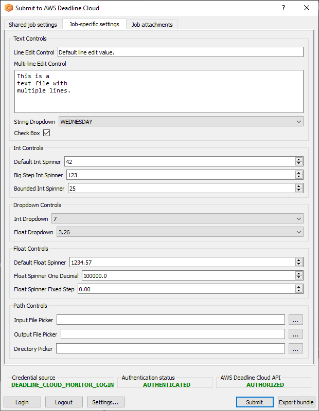

## Deadline Cloud samples

This repository contains a set of samples to use with [AWS Deadline Cloud](https://aws.amazon.com/deadline-cloud/).

## Job bundle samples

The [job_bundles](https://github.com/aws-deadline/deadline-cloud-samples/tree/mainline/job_bundles)
directory contains sample jobs that you can submit to your Deadline Cloud queue. You can use the
[Deadline Cloud CLI](https://github.com/aws-deadline/deadline-cloud) to submit these jobs to your queues.

### CLI job submission

```
$ deadline bundle submit job_bundles/cli_job -p DataDir=~/data_dir
```

### GUI job submission
```
$ deadline bundle gui-submit job_bundles/gui_control_showcase
```



## Queue environment samples

The [queue_environments](https://github.com/aws-deadline/deadline-cloud-samples/tree/mainline/queue_environments)
directory contains sample [queue environments](https://docs.aws.amazon.com/deadline-cloud/latest/userguide/create-queue-environment.html)
you can attach to your Deadline Cloud queue, to provide software applications to your jobs from
[Conda](https://docs.conda.io/projects/conda/) or [Rez](https://rez.readthedocs.io/).

## Additional resources

* [AWS Deadline Cloud user guide](https://docs.aws.amazon.com/deadline-cloud/latest/userguide/index.html)
* [AWS Deadline Cloud API reference](https://docs.aws.amazon.com/deadline-cloud/latest/APIReference/index.html)
* [Open Job Description](https://github.com/OpenJobDescription/openjd-specifications/wiki)

## Security

See [CONTRIBUTING](CONTRIBUTING.md#security-issue-notifications) for more information.

## License

This library is licensed under the MIT-0 License. See the LICENSE file.
