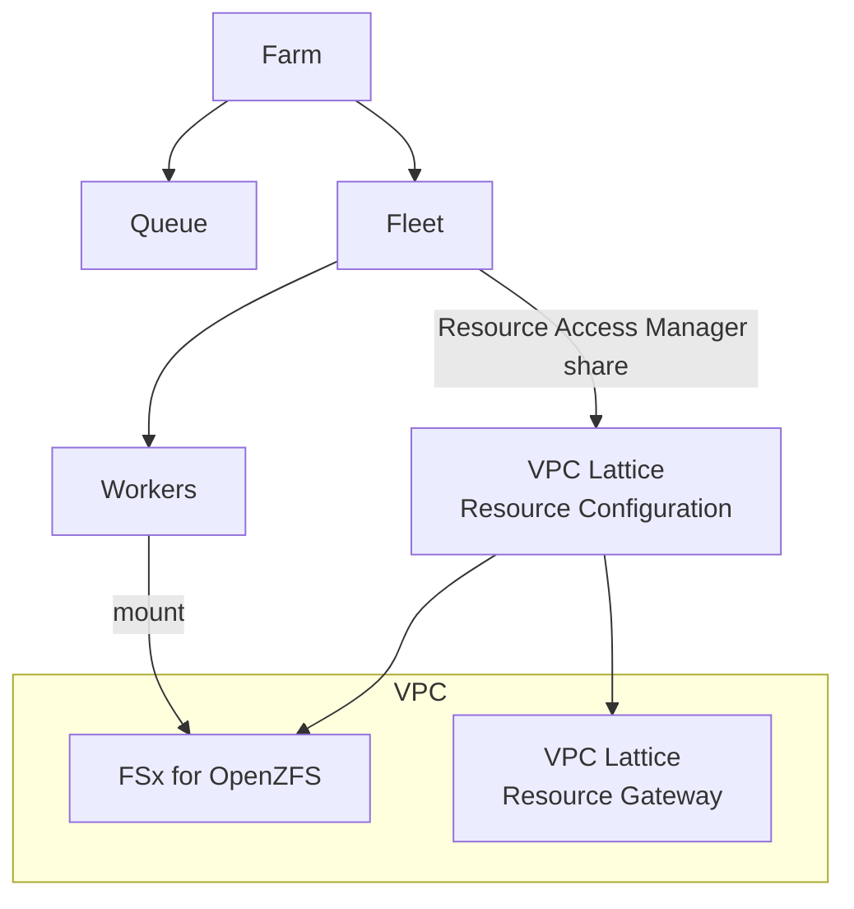

# Service-Managed Fleet with VPC Resource Endpoint and FSx for OpenZFS

## Overview

This CloudFormation template demonstrates how to set up AWS Deadline Cloud with a service-managed fleet
that connects to FSx for OpenZFS storage through a VPC resource endpoint. The FSx cluster runs in a VPC,
and VPC Lattice resource configuration establishes the connection between Deadline workers and the storage.
The resource configuration is shared with the Deadline service using AWS Resource Access Manager.



This pattern is useful when you need Deadline Cloud workers to access:
- Shared file storage (FSx for Lustre, FSx for OpenZFS, EFS)
- License servers running in your VPC
- Other private resources that aren't accessible from the public internet

## Prerequisites

Before deploying this CloudFormation template, ensure you have:

1. An AWS account with permissions to create the resources in this template
2. The AWS CLI installed and configured
3. A Deadline Cloud monitor to view and manage jobs. From the
   [AWS Deadline Cloud management console](https://console.aws.amazon.com/deadlinecloud/home),
   select "Go to Monitor setup" and follow the steps to create a monitor.

## Setup Instructions

### Deploy the CloudFormation template

Deploying this template requires two steps because the FSx IP address is only available after the
file system creates its network interface.

#### Step 1: Initial deployment

1. Download the [deadline-cloud-smf-vpc-fsx-template.yaml](deadline-cloud-smf-vpc-fsx-template.yaml)
   CloudFormation template.
2. From the [CloudFormation management console](https://console.aws.amazon.com/cloudformation/),
   navigate to Create Stack > With new resources (standard).
3. Upload the template file.
4. Enter a stack name like "SMF-VPC-FSx" and adjust parameters as needed.
5. Check "I acknowledge that AWS CloudFormation might create IAM resources" and create the stack.
6. Wait for the stack to reach CREATE_COMPLETE status (~10-15 minutes for FSx).

#### Step 2: Update with FSx IP address

1. Go to the [FSx console](https://console.aws.amazon.com/fsx/) and select your file system.
2. Click on the "Network & security" tab.
3. Find the "Network interface" section and click on the ENI ID.
4. In the EC2 console, copy the "Private IPv4 address" from the network interface details.
5. Return to CloudFormation, select your stack, and click "Update".
6. Select "Use current template" and click Next.
7. Update the `FSxClusterIP` parameter with the IP address you copied.
8. Complete the update wizard.

Alternatively, use the AWS CLI to get the IP and update the stack:

```bash
# Get the FSx file system ID from stack outputs
FSX_ID=$(aws cloudformation describe-stacks \
  --stack-name SMF-VPC-FSx \
  --query 'Stacks[0].Outputs[?OutputKey==`FSxFileSystemId`].OutputValue' \
  --output text)

# Get the ENI ID
ENI_ID=$(aws fsx describe-file-systems \
  --file-system-ids $FSX_ID \
  --query 'FileSystems[0].NetworkInterfaceIds[0]' \
  --output text)

# Get the private IP
FSX_IP=$(aws ec2 describe-network-interfaces \
  --network-interface-ids $ENI_ID \
  --query 'NetworkInterfaces[0].PrivateIpAddress' \
  --output text)

echo "FSx IP: $FSX_IP"

# Update the stack
aws cloudformation update-stack \
  --stack-name SMF-VPC-FSx \
  --use-previous-template \
  --capabilities CAPABILITY_IAM \
  --parameters ParameterKey=FSxClusterIP,ParameterValue=$FSX_IP
```

### Grant yourself access to the farm

From the [AWS Deadline Cloud management console](https://console.aws.amazon.com/deadlinecloud/home),
navigate to the farm, select the "Access management" tab, then "Users", and add yourself with "Owner" access.

## Submit a test job

The [test-job.yaml](test-job.yaml) job template verifies that workers can mount and read/write to the FSx file system.

1. Get the Farm ID and Queue ID from the CloudFormation stack outputs:

```bash
FARM_ID=$(aws cloudformation describe-stacks \
  --stack-name SMF-VPC-FSx \
  --query 'Stacks[0].Outputs[?OutputKey==`FarmId`].OutputValue' \
  --output text)

QUEUE_ID=$(aws cloudformation describe-stacks \
  --stack-name SMF-VPC-FSx \
  --query 'Stacks[0].Outputs[?OutputKey==`QueueId`].OutputValue' \
  --output text)
```

2. Submit the job:

```bash
aws deadline create-job \
  --farm-id $FARM_ID \
  --queue-id $QUEUE_ID \
  --template file://test-job.yaml \
  --template-type YAML \
  --priority 50
```

3. Monitor the job from Deadline Cloud monitor or using the CLI:

```bash
aws deadline get-job --farm-id $FARM_ID --queue-id $QUEUE_ID --job-id <JOB_ID>
```

## Cleanup

To delete all resources created by this template:

```bash
aws cloudformation delete-stack --stack-name SMF-VPC-FSx
```

Note: FSx file systems can take a few minutes to delete.

## Related Documentation

- [Service-managed fleets with VPC resource endpoints](https://docs.aws.amazon.com/deadline-cloud/latest/developerguide/smf-vpc.html)
- [FSx for OpenZFS User Guide](https://docs.aws.amazon.com/fsx/latest/OpenZFSGuide/)
- [VPC Lattice User Guide](https://docs.aws.amazon.com/vpc-lattice/latest/ug/)
- [AWS Resource Access Manager](https://docs.aws.amazon.com/ram/latest/userguide/)
