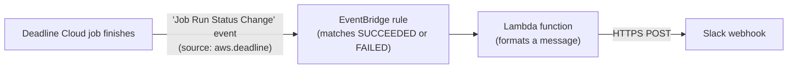

# Job event Slack notifications with Lambda and EventBridge

This CloudFormation template demonstrates the general mechanism for connecting an AWS Lambda
function to AWS Deadline Cloud job events through Amazon EventBridge. The specific scenario it
implements is sending a [Slack](https://slack.com/) notification whenever a job completes
(`SUCCEEDED`) or fails (`FAILED`).

Deadline Cloud publishes [events to EventBridge](https://docs.aws.amazon.com/deadline-cloud/latest/userguide/eventbridge.html)
on the default event bus of the AWS account and Region that owns the farm. This template creates
an EventBridge rule that matches those job events and invokes a Lambda function, which posts a
formatted message to a Slack channel using an [Incoming Webhook](https://api.slack.com/messaging/webhooks).

You can adapt the Lambda function to do anything else you like with the event: send an email,
open a ticket, update a dashboard, or trigger a downstream workflow.

## Using a different messaging app

This sample uses Slack, but many messaging apps expose the same style of incoming webhook: you
create a webhook URL and `POST` a JSON message to it. To target one of these instead, set that
app's webhook URL as the `SLACK_WEBHOOK_URL` environment variable and adjust the JSON body the
Lambda function builds to match the app's expected payload (each app formats its message JSON
differently). The docs below explain how to create a webhook for each:

- [Slack](https://api.slack.com/messaging/webhooks)
- [Microsoft Teams](https://learn.microsoft.com/en-us/microsoftteams/platform/webhooks-and-connectors/how-to/add-incoming-webhook)
- [Discord](https://discord.com/developers/docs/resources/webhook)
- [Google Chat](https://developers.google.com/workspace/chat/quickstart/webhooks)
- [Mattermost](https://developers.mattermost.com/integrate/webhooks/incoming/)

## How it works



The `Job Run Status Change` event carries a `detail` payload with the job's identifiers and its
new status:

```json
{
  "version": "0",
  "detail-type": "Job Run Status Change",
  "source": "aws.deadline",
  "account": "111122223333",
  "region": "us-west-2",
  "resources": [],
  "detail": {
    "farmId": "farm-0123456789abcdef0123456789abcdef",
    "queueId": "queue-0123456789abcdef0123456789abcdef",
    "jobId": "job-0123456789abcdef0123456789abcdef",
    "previousTaskRunStatus": "RUNNING",
    "taskRunStatus": "SUCCEEDED",
    "taskRunStatusCounts": {
      "SUCCEEDED": 1,
      "FAILED": 0,
      "...": 0
    }
  }
}
```

The EventBridge rule filters on `detail.taskRunStatus` so the Lambda function is only invoked for
finished jobs, not for every intermediate status change.

## Resources created

1. **IAM role** (`JobEventsSlackFunctionRole`): Execution role for the Lambda function. It grants
   only CloudWatch Logs write access (via the `AWSLambdaBasicExecutionRole` managed policy). The
   function needs no other AWS permissions because it reaches Slack over HTTPS.
2. **Lambda function** (`JobEventsSlackFunction`): A small Python function (standard library only,
   defined inline in the template) that formats the job event and posts it to the Slack webhook URL
   held in its `SLACK_WEBHOOK_URL` environment variable.
3. **Lambda permission** (`JobEventsSlackFunctionPermission`): Allows EventBridge to invoke the
   function.
4. **EventBridge rule** (`JobEventsRule`): Matches `Job Run Status Change` events with a
   `taskRunStatus` of `SUCCEEDED` or `FAILED` (optionally scoped to a single farm) and targets the
   Lambda function.

## Prerequisites

1. A Deadline Cloud farm in the same AWS account and Region where you deploy this stack. Job events
   are delivered to the event bus of the farm's account and Region, so the stack must be deployed
   there.
2. A Slack Incoming Webhook URL. To create one:
   - Go to <https://api.slack.com/apps> and create (or open) a Slack app in your workspace.
   - Enable **Incoming Webhooks**, then **Add New Webhook to Workspace** and choose the channel to
     post to.
   - Copy the generated webhook URL. It has the form
     `https://hooks.slack.com/services/<workspace-id>/<channel-id>/<token>`.
3. The AWS CLI installed and configured with credentials for the account (if deploying via CLI).

## Parameters

| Parameter | Default | Description |
|---|---|---|
| `EventSource` | `aws.deadline` | EventBridge source for Deadline Cloud events. Keep the default for production. |
| `FarmId` | *(empty)* | Optional. Restrict notifications to a single farm ID. Leave blank for all farms. |
| `SlackWebhookUrl` | *(empty)* | Optional. Slack webhook URL. Can be left blank and set on the Lambda function later. |

## Deployment

### AWS CLI

```bash
aws cloudformation deploy \
  --stack-name deadline-job-events-slack \
  --template-file job_events_slack_lambda_template.yaml \
  --capabilities CAPABILITY_IAM \
  --region us-west-2 \
  --parameter-overrides \
    SlackWebhookUrl='https://hooks.slack.com/services/<workspace-id>/<channel-id>/<token>'
```

Replace the webhook URL with your own. To scope notifications to a single farm, add
`FarmId=farm-...` to `--parameter-overrides`.

### Setting the webhook URL after deployment

If you prefer not to pass the webhook URL as a stack parameter, deploy without it and then set the
environment variable directly on the Lambda function:

```bash
aws lambda update-function-configuration \
  --function-name <FunctionName-from-stack-outputs> \
  --environment "Variables={SLACK_WEBHOOK_URL=https://hooks.slack.com/services/<workspace-id>/<channel-id>/<token>}" \
  --region us-west-2
```

Get `<FunctionName-from-stack-outputs>` from the stack's `FunctionName` output.

### AWS Console

1. Open the AWS CloudFormation console in the Region that owns your farm.
2. Choose **Create stack** → **With new resources (standard)**.
3. Upload `job_events_slack_lambda_template.yaml`.
4. Provide the parameters (at minimum, your `SlackWebhookUrl`).
5. Acknowledge that the stack creates IAM resources, and create the stack.

## Slack message format

The Lambda function posts a message using Slack's [`text`](https://api.slack.com/reference/messaging/payload)
field, formatted with [mrkdwn](https://api.slack.com/reference/surfaces/formatting). The message is
built from the following values taken from the event:

| Line | Source field | Example |
|---|---|---|
| `Deadline Cloud job <status>` | `detail.taskRunStatus` (lower-cased) | `Deadline Cloud job succeeded` |
| `Job` | `detail.jobId` | `job-0123456789abcdef0123456789abcdef` |
| `Queue` | `detail.queueId` | `queue-0123456789abcdef0123456789abcdef` |
| `Farm` | `detail.farmId` | `farm-0123456789abcdef0123456789abcdef` |
| `Region` | top-level `region` | `us-west-2` |

A delivered message looks like this:

```
Deadline Cloud job succeeded
Job: job-0123456789abcdef0123456789abcdef
Queue: queue-0123456789abcdef0123456789abcdef
Farm: farm-0123456789abcdef0123456789abcdef
Region: us-west-2
```

The exact JSON posted to the webhook is:

```json
{
  "text": "*Deadline Cloud job succeeded*\nJob: `job-0123456789abcdef0123456789abcdef`\nQueue: `queue-0123456789abcdef0123456789abcdef`\nFarm: `farm-0123456789abcdef0123456789abcdef`\nRegion: `us-west-2`"
}
```

To change what the message says, edit the `text` value the Lambda function builds in the template.
Any field from the event `detail` (see the JSON example above) is available to include.

## Testing

Submit a job to your farm and let it finish (or cancel a task so it fails). Within a few seconds of
the job reaching `SUCCEEDED` or `FAILED`, a message appears in your Slack channel. You can also
inspect the function's execution in its CloudWatch Logs log group (`/aws/lambda/<FunctionName>`).

## Further reading

- [Managing Deadline Cloud events using Amazon EventBridge](https://docs.aws.amazon.com/deadline-cloud/latest/userguide/eventbridge-integration.html):
  how Deadline Cloud publishes events, the list of event detail types, and how to write rules to
  route them.
- [Deadline Cloud events detail reference](https://docs.aws.amazon.com/deadline-cloud/latest/userguide/events-detail-reference.html):
  the `detail` schema for each event, including `Job Run Status Change`.
- [Amazon EventBridge event patterns](https://docs.aws.amazon.com/eventbridge/latest/userguide/eb-event-patterns.html):
  how the rule's `EventPattern` matching works.
- [Amazon EventBridge rule targets](https://docs.aws.amazon.com/eventbridge/latest/userguide/eb-targets.html):
  how a rule invokes a target such as a Lambda function.
- [Using AWS Lambda with Amazon EventBridge](https://docs.aws.amazon.com/lambda/latest/dg/services-eventbridge.html):
  the Lambda side of the integration.
- [Sending messages using incoming webhooks](https://api.slack.com/messaging/webhooks) and
  [message payload formatting](https://api.slack.com/reference/surfaces/formatting): the Slack APIs
  used by the Lambda function.
