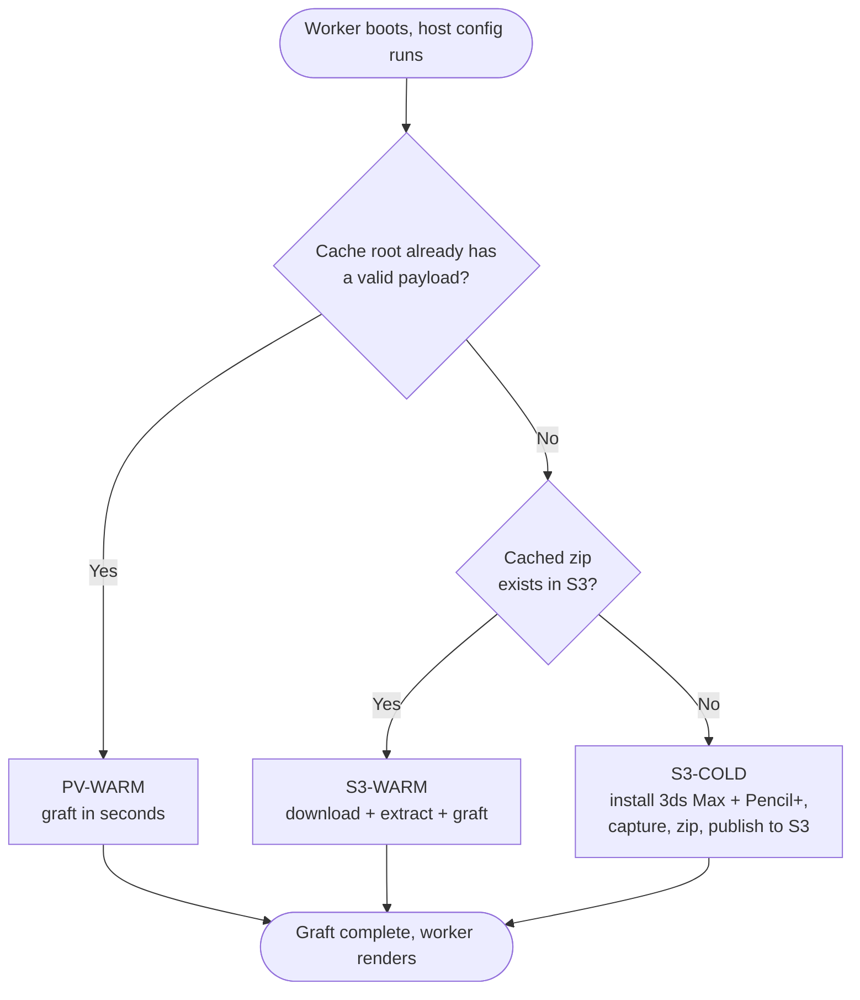

# 3ds Max 2026 + Pencil+ 4 host configuration (S3-cached, persistent-volume accelerated)

This host configuration installs 3ds Max 2026 and Pencil+ 4 on AWS Deadline Cloud Windows
service-managed fleet workers. Unlike the standard scripts, it installs only once. The result is
captured to S3 and reused on every later worker rather than reinstalled. A fleet persistent
volume is an optional accelerator on top of the S3 cache.

3ds Max 2026 is not affected by the 3ds Max 2027 Autodesk ADP "Failed to start" issue, so no
ADP workaround is needed here.

## Files

| File | Purpose |
|---|---|
| [`s3-hosted-3dsmax-2026-pencilplus-persistent.ps1`](s3-hosted-3dsmax-2026-pencilplus-persistent.ps1) | The full host configuration script. On a cold boot it installs 3ds Max 2026 + Pencil+ 4 and captures the payload. On warm boots it grafts that payload. |
| [`s3-bootstrap-loader.ps1`](s3-bootstrap-loader.ps1) | An inline loader that downloads and runs the full script from S3. Use it because the full script exceeds the 15,000-character inline `scriptBody` limit. |

The `s3-hosted-` prefix marks a script that is fetched from S3 at boot rather than pasted into the
fleet, so the 15,000-character limit applies to the loader beside it. Repository validation keys the
exemption off that prefix.

## Boot paths and cache tiers

The install is always reached through NTFS junctions, so the payload can live on the fleet's
persistent volume or a local disk. On boot the script picks one path:




| Boot path | When it runs | What happens |
|---|---|---|
| S3-COLD | This generation has yet to publish a cached zip | The worker runs the real 3ds Max + Pencil+ installers. The registry, services, licensing, and .NET state are captured into a zip and published to S3. Normally happens once per version, farm-wide. |
| S3-WARM | A cached zip exists in S3 | Download and extract the payload into the cache root (any Availability Zone, with or without a persistent volume), then graft. Minutes instead of a full install. |
| PV-WARM | An earlier boot left a valid payload in the cache root, whether that is the persistent volume or `C:\DeadlineCache` | Skip the download and graft in seconds. |

Measured on a service-managed GPU fleet with a persistent volume, installing 3ds Max 2026 and
Pencil+ 4:

| Path | Measured | Breakdown |
|---|---|---|
| S3-COLD | 21m 22s | installer download 1m30s, extract 40s, 3ds Max Setup 6m39s, zip create 10m52s, upload 44s |
| S3-WARM | 2m 54s | zip download 1m26s, extract 1m22s, then graft |
| PV-WARM | 5 to 7s | registry import, service registration, and the render check |

The payload zip is 6.7 GB for 3ds Max 2026 plus Pencil+ 4, and building it dominates the cold path.
Each path above was exercised on a real fleet, and a worker restored from the published zip rendered a
scene with `3dsmaxcmd` successfully, so the archive is validated by use rather than only by the checks
that run while it is built.

Some content appears twice in the zip, because tar follows the two `Current` version junctions a
3ds Max install leaves under `Software\`, which the script logs as a warning on every publish.

The script doesn't coordinate between workers. Workers that boot cold in the same window each run
their own install, matching what the standard non-caching scripts do on every boot. Whoever finishes
last then checks S3 and skips the upload if a zip is already published.

A lock would save those duplicate installs on the first boot of a generation. Paying for it means
adding a wait-and-poll path, which fails a boot outright whenever it misjudges a live installer as
dead. This sample accepts the occasional duplicate install instead.

The cache root is the persistent volume when the fleet has one, and `C:\DeadlineCache` otherwise. The
fast graft path keys off a valid payload in that root rather than off the volume, so a worker that
reboots takes it either way. Attach a persistent volume when you want the payload to outlast the
instance itself, which is a different guarantee from keeping it across a reboot.

The zip payload contains `Software\`, `SoftwareData\`, and `SoftwareRegistry\`.
`.install-state.json` lives inside `SoftwareRegistry\` and travels with it.

`SoftwareData\FLEXnet` holds the licensing trusted-storage that FlexNet writes under
`C:\ProgramData\FLEXnet`, and every worker restoring the payload receives the copy captured by
whichever worker published it. A PV-WARM seed re-runs the capture before publishing so the zip is
internally consistent, and the data is still one worker's rather than freshly initialized per host.
Watch for licensing that works on the publishing worker and fails elsewhere, and drop `FLEXnet`
from the capture if your licensing setup needs per-host state.

`Test-PayloadComplete` refuses to publish a payload missing either licensing directory, because
every restore requires both. If a future 3ds Max stops using one of those paths, the log names it and
you drop it from the `-Required` calls in `Import-InstallerState`.

## Prerequisites

- The fleet's `scriptTimeoutSeconds` raised toward 3600, which is the service maximum. A cold
  install downloads a multi-GB installer, runs Autodesk Setup, and uploads the payload zip, none of
  which fits the 300-second default. The worker is killed part-way through otherwise.
- AWS CLI v2 on the worker, already present on Deadline Cloud service-managed fleet workers.
- An S3 bucket hosting the 3ds Max 2026 installer zip and the Pencil+ 4 installer executable.
  Create the 3ds Max zip following the guide in the parent
  [README](../README.md#creating-a-3ds-max-installer-archive-in-zip-format).
- Pencil+ 4 (NTR edition) from [PSOFT](https://www.psoft.co.jp/en/download/). This sample uses the
  NTR edition with `3dsmaxcmd.exe`. Cloud rendering rights for both 3ds Max and Pencil+ are yours to
  confirm against the terms Autodesk and PSOFT provide.
- A fleet IAM role with `s3:GetObject` on the installers, plus `s3:GetObject`, `s3:PutObject`,
  `s3:DeleteObject`, and `s3:ListBucket` on the cache prefix (`$S3_CACHE`, such as
  `s3://your-bucket-name/DeadlineCloud/pv-cache/3dsmax-2026/*`). `s3:ListBucket` goes on the bucket
  rather than the prefix. Without it S3 answers a missing key with `403` instead of `404`, so the
  script treats `403` as "no cached payload yet" and cold installs. That is only a first-boot
  question: once the zip exists, `HeadObject` returns it regardless of listing permission, so a fleet
  without `s3:ListBucket` still works and starts using the cache from the second boot onward.
  `s3:DeleteObject` is used to clean up the temporary upload key a publish writes before moving the
  zip into place.
- An S3 lifecycle rule on the cache prefix with `AbortIncompleteMultipartUpload` set to a day or
  two. A worker terminated mid-publish can leave an orphaned multipart upload that is billed but
  invisible to `aws s3 ls`.

Two permissions mistakes on the cache prefix fail without announcing themselves. Check the fleet
role against both before looking at the script.

A missing `s3:PutObject` lets workers read the installers and cold install correctly, then fail to
publish, so nothing is ever cached and the next worker repeats the whole thing. The signature is every
boot taking the cold path with a `WARNING: S3 publish failed (non-fatal)` line in the log and an empty
cache prefix.

A missing `s3:GetObject` on the cache prefix produces the opposite signature. The script reads `403`
as "no cached payload yet", so a role that can write the prefix without reading it cold installs and
then re-uploads the whole payload on every boot, and the publish genuinely succeeds so no warning ever
appears. The tell is a cache object whose `LastModified` keeps advancing while every boot still takes
the cold path.

## Security and trust

The cache prefix is a code-distribution channel, not just a file store. On every warm boot the
script runs as SYSTEM. From the cached zip it imports registry files and registers services, and
it copies files into `C:\Program Files`. Anyone who can write to the cache prefix or to the script
object that `s3-bootstrap-loader.ps1` downloads can run code as SYSTEM on every worker that boots
afterward, farm-wide.

Workers write the cache prefix at runtime and never write the loader's script object, so each one
needs different permissions.

- Grant `s3:PutObject` on the cache prefix to the fleet role alone. Workers
  publish `pv-payload.zip` themselves, so the fleet role has to write here. A compromised worker
  reaching persistent SYSTEM across the fleet is a residual risk of this caching design rather
  than something the permissions can remove. Use a bucket policy with `aws:SourceArn` or
  `aws:SourceAccount` conditions, and enable S3 Block Public Access.
- Keep `s3:PutObject` on the loader's script object with your deployment or administrator
  principal only. The fleet role needs `s3:GetObject` and must not have `s3:PutObject` here. Your
  deployment step is the only writer, so grant every worker read access alone.
- Do not share the prefix across farms or with any principal that should not run code as SYSTEM.
- Enable bucket versioning on the prefix so a bad or tampered object can be rolled back.
- Record a SHA-256 of the published zip somewhere the fleet role cannot write, and verify it
  after download, when you want provenance rather than only access control.

The script sets an explicit ACL on one directory, `SoftwareRegistry\`, granting SYSTEM and
Administrators only. That tree holds the `graft\` directory of `.reg` files and the
`.install-state.json` gate. `Import-InstallerState` runs `reg import` over everything in `graft\` as
SYSTEM on every boot, and `.install-state.json` is the only gate on the fast graft path, so a file the
job user could add or forge there would become SYSTEM-level registry content or would steer which boot
path runs next. A new directory under `C:\` inherits `CreateFiles` and `AppendData` for
`BUILTIN\Users`, which is enough to add a new file, so the inherited ACL is not sufficient here.

Everything else keeps its inherited ACL. The inherited ACL already denies the job user modifying or
deleting existing files, which covers the installed payload under `Software\`. `SoftwareData\` has to
stay writable in any case, because `C:\ProgramData\Autodesk` is junctioned into it and the Autodesk
licensing stack writes license state and logs there. The cache root is left alone deliberately: it can
be a persistent volume drive root, and rewriting a whole volume's ACL would change access for anything
else stored on it.

`SoftwareData\Autodesk\ApplicationPlugins` is archived rather than excluded, and it has to be.
Autodesk installs bundled plugins there, including MAXtoA, the Arnold renderer that 3ds Max uses by
default. Excluding the directory produced a cache whose restored workers logged
`Missing dll: maxtoa.dlr` and failed every render, while cold-install workers were unaffected. The
directory is writable by the job user, so a dropped `.bundle` can reach the published zip through
whichever worker seeds it. That exposure is accepted deliberately, because the alternative is a
cached 3ds Max that cannot render at all. `Test-PayloadComplete` refuses to publish a payload with no `maxtoa.dlr`, and
every publish logs the bundles it archives.

The job user can still create new files in the payload directories, so a DLL placed beside a 3ds Max
executable could be loaded by a later render. A persistent volume is not wiped between boots, so such a
file stays there. The seed path then publishes it to the whole farm. Check the mount's own ACL when
you attach a volume: the script assumes rather than verifies that the root is not writable by the job
user.

## Configuration reference

Set these at the top of `s3-hosted-3dsmax-2026-pencilplus-persistent.ps1`:

| Variable | Meaning |
|---|---|
| `$CACHE_GENERATION` | Part of the cache key. Bump it to rebuild the payload farm-wide. |
| `$LOCAL_CACHE_ROOT` | Cache root used when the fleet has no persistent volume. Defaults to `C:\DeadlineCache`. A directory path is expected. Setting it to a bare drive letter works, but that drive has to exist on the worker: host configuration fails with `cache root E:\ is not mounted` rather than writing the payload somewhere unintended. |
| `$3DS_MAX_INSTALLER_ZIP_S3_URI` | The 3ds Max 2026 installer zip. Recorded in the state file, so changing it invalidates a worker's local cache. |
| `$PENCILPLUS_INSTALLER_S3_URI` | The Pencil+ 4 installer executable. Leave blank to skip Pencil+. |
| `$S3_CACHE` | Prefix the payload zip is published under. |

Changing `$3DS_MAX_INSTALLER_ZIP_S3_URI` or `$PENCILPLUS_INSTALLER_S3_URI` invalidates a worker's
local cache automatically, because the state file records the full installer URIs. To rebuild the
farm-global payload, bump `$CACHE_GENERATION`:

```powershell
$CACHE_GENERATION = "2"
```

The generation is part of the S3 key. Every worker converges on a new object and none of them
deletes anything. A worker booting mid-rollout either restores the new payload or builds it,
never both, and there is no flag to remember to switch back. Delete the old `gen-*` prefix once the new
generation is in service.

The adaptor (`deadline-cloud-for-3ds-max`) is installed on the cold path and travels in the
cached payload, so warm boots reuse the cached version rather than reinstalling from PyPI. To
move to a newer adaptor, invalidate the cache as above so a fresh cold install picks it up.

## Setup

1. Stage the installers in S3 and set the `TODO` URIs at the top of
   `s3-hosted-3dsmax-2026-pencilplus-persistent.ps1`: `$3DS_MAX_INSTALLER_ZIP_S3_URI`,
   `$PENCILPLUS_INSTALLER_S3_URI`, and `$S3_CACHE`.
2. Upload the full script to S3:
   ```console
   aws s3 cp s3-hosted-3dsmax-2026-pencilplus-persistent.ps1 s3://your-bucket-name/DeadlineCloud/host-config/s3-hosted-3dsmax-2026-pencilplus-persistent.ps1
   ```
3. Set `$HC_SCRIPT_S3_URI` in `s3-bootstrap-loader.ps1` to that object.
4. Paste `s3-bootstrap-loader.ps1` as the fleet's inline host-configuration script and save.
5. Grant the fleet IAM role `s3:GetObject` on the script object and the installers, plus
   read/write on the cache prefix.

To update the host configuration later, re-upload the full script to S3. No fleet configuration
change is needed. Version or pin the object: a missing or broken object fails every worker's
boot, so treat updates to it with the same care as the fleet configuration.

## Verifying

Set the fleet's minimum worker count to 1 and review the worker's CloudWatch logs
(`/aws/deadline/farm-<farm-id>/fleet-<fleet-id>`). Confirm the boot path line, such as
`=== S3-WARM boot ===`, and `exit code: 0`. The first worker performs the cold install and
publishes the zip. Later workers restore from it. Then submit a Pencil+ scene and confirm the task renders.

## Troubleshooting

`reg export WOW Autodesk failed: 1`

The capture treats both the 64-bit and 32-bit Autodesk registry keys as mandatory, so a cold install
fails here when one is absent. A 3ds Max 2026 install writes both, which is the version this sample
is verified against. A later 3ds Max may stop writing the 32-bit key
(`HKLM\SOFTWARE\Wow6432Node\Autodesk`), and the cold install then fails after paying the full install
cost rather than publishing a payload with part of the registry missing. Switch that `reg.exe export`
call in `Export-InstallerState` to `Export-RegKey`, which skips an absent key, when you are adding
support for a version that no longer writes it.