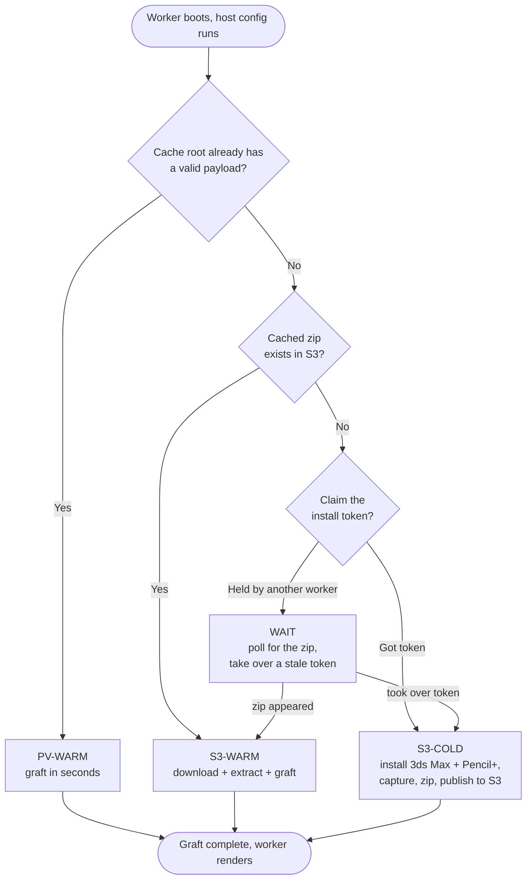

# 3ds Max 2026 + Pencil+ 4 host configuration (S3-cached, persistent-volume accelerated)

This host configuration installs 3ds Max 2026 and Pencil+ 4 on AWS Deadline Cloud Windows
service-managed fleet workers. Unlike the standard scripts, it installs only once. The result is
captured to S3 and reused on every later worker rather than reinstalled. A fleet persistent
volume is an optional accelerator on top of the S3 cache.

3ds Max 2026 is not affected by the 3ds Max 2027 Autodesk ADP "Failed to start" issue, so no
ADP workaround is needed here.

## Files

| File | Purpose |
|---|---|
| [`s3-hosted-3dsmax-2026-pencilplus-persistent.ps1`](s3-hosted-3dsmax-2026-pencilplus-persistent.ps1) | The full host configuration script. On a cold boot it installs 3ds Max 2026 + Pencil+ 4 and captures the payload. On warm boots it grafts that payload. |
| [`s3-bootstrap-loader.ps1`](s3-bootstrap-loader.ps1) | An inline loader that downloads and runs the full script from S3. Use it because the full script exceeds the 15,000-character inline `scriptBody` limit. |

The `s3-hosted-` prefix marks a script that is fetched from S3 at boot rather than pasted into the
fleet, so the 15,000-character limit applies to the loader beside it. Repository validation keys the
exemption off that prefix.

## Boot paths and cache tiers

The install is always reached through NTFS junctions, so the payload can live on the fleet's
persistent volume or a local disk. On boot the script picks one path:




| Boot path | When it runs | What happens |
|---|---|---|
| S3-COLD | The first worker to boot a new version | One worker claims a token and runs the real 3ds Max + Pencil+ installers. The registry, services, licensing, and .NET state are captured into a zip and published to S3. The cold install runs once per version, farm-wide. |
| S3-WARM | A cached zip exists in S3 | Download and extract the payload into the cache root (any Availability Zone, with or without a persistent volume), then graft. Minutes instead of a full install. |
| PV-WARM | An earlier boot left a valid payload in the cache root, whether that is the persistent volume or `C:\DeadlineCache` | Skip the download and graft in seconds. |
| WAIT | Another worker holds the install token | Poll for its zip. A stale token from a crashed installer is taken over. |

The cache root is the persistent volume when the fleet has one, and `C:\DeadlineCache` otherwise. The
fast graft path keys off a valid payload in that root rather than off the volume, so a worker that
reboots takes it either way. Attach a persistent volume when you want the payload to outlast the
instance itself, which is a different guarantee from keeping it across a reboot.

The zip payload contains `Software\`, `SoftwareData\`, and `SoftwareRegistry\`.
`.install-state.json` lives inside `SoftwareRegistry\` and travels with it.

`SoftwareData\FLEXnet` carries the licensing trusted-storage that FlexNet writes under
`C:\ProgramData\FLEXnet`, and every worker restoring the payload receives the copy captured by
whichever worker published it. A PV-WARM seed re-runs the capture before publishing so the zip is
internally consistent, and the data is still one worker's rather than freshly initialized per host.
Watch for licensing that works on the publishing worker and fails elsewhere, and drop `FLEXnet`
from the capture if your licensing setup needs per-host state.

## Prerequisites

- AWS CLI v2.22 or newer on the worker. The install token relies on conditional writes:
  `put-object --if-none-match` to claim it and `--if-match` to take over a dead holder's claim.
  S3 added those in August and November 2024 respectively, so a CLI that accepts one but rejects
  the other still leaves the takeover broken. An older CLI falls back to a racy check where two
  workers booting together can both run the install, and the script logs a warning saying so.
- An S3 bucket hosting the 3ds Max 2026 installer zip and the Pencil+ 4 installer executable.
  Create the 3ds Max zip following the guide in the parent
  [README](../README.md#creating-a-3ds-max-installer-archive-in-zip-format).
- Pencil+ 4 (NTR edition) from [PSOFT](https://www.psoft.co.jp/en/download/). Pencil+ (NTR)
  renders watermark-free without a license when 3ds Max runs as a render server, which
  `3dsmaxcmd.exe` is.
- A fleet IAM role with `s3:GetObject` on the installers, plus `s3:GetObject`, `s3:PutObject`,
  and `s3:DeleteObject` on the cache prefix (`$S3_CACHE`, such as
  `s3://your-bucket-name/DeadlineCloud/pv-cache/3dsmax-2026/*`). `s3:DeleteObject` is required
  so the install token is released after a cold install. Without it, later workers wait out the
  full timeout on every boot.
- An S3 lifecycle rule on the cache prefix with `AbortIncompleteMultipartUpload` set to a day or
  two. A worker terminated mid-publish can leave an orphaned multipart upload that is billed but
  invisible to `aws s3 ls`.

## Security and trust

The cache prefix is a code-distribution channel, not just a file store. On every warm boot the
script runs as SYSTEM. From the cached zip it imports registry files and registers services, and
it copies files into `C:\Program Files`. Anyone who can write to the cache prefix or to the script
object that `s3-bootstrap-loader.ps1` downloads can run code as SYSTEM on every worker that boots
afterward, farm-wide.

Workers write the cache prefix at runtime and never write the loader's script object, so each one
needs different permissions.

- Grant `s3:PutObject` on the cache prefix to the fleet role alone. Workers
  publish `pv-payload.zip` themselves, so the fleet role has to write here. A compromised worker
  reaching persistent SYSTEM across the fleet is a residual risk of this caching design rather
  than something the permissions can remove. Use a bucket policy with `aws:SourceArn` or
  `aws:SourceAccount` conditions, and enable S3 Block Public Access.
- Keep `s3:PutObject` on the loader's script object with your deployment or administrator
  principal only. The fleet role needs `s3:GetObject` and must not have `s3:PutObject` here. Your
  deployment step is the only writer, so grant every worker read access alone.
- Do not share the prefix across farms or with any principal that should not run code as SYSTEM.
- Enable bucket versioning on the prefix so a bad or tampered object can be rolled back.
- Record a SHA-256 of the published zip somewhere the fleet role cannot write, and verify it
  after download, when you want provenance rather than only access control.

The script hardens the three payload trees rather than the cache root. `Software\` and
`SoftwareRegistry\` become read-only for `BUILTIN\Users`, and `SoftwareData\` is deliberately left
writable because `C:\ProgramData\Autodesk` is junctioned into it and the Autodesk licensing stack
writes license state and logs there. The installer staging directory is locked to SYSTEM and
Administrators only, since `Setup.exe` runs from it as SYSTEM.

The cache root itself keeps its inherited ACL, because hardening it would mean rewriting the ACL of a
whole persistent volume and changing access for anything else stored there. The script keeps
everything it later feeds to SYSTEM out of that root. `.install-state.json` lives inside the hardened
`SoftwareRegistry\` tree, since it is the only gate on the fast graft path and a forgeable copy would
let an unprivileged task steer which path the next boot takes. The transient `pv-payload.zip` is
downloaded into a `staging\` directory locked to SYSTEM and Administrators, because it is extracted as
SYSTEM straight into the payload trees.

A persistent volume still needs the mount's own ACL checked when you attach one, because the script
assumes rather than verifies that the root is not writable by the job user.

## Configuration reference

Set these at the top of `s3-hosted-3dsmax-2026-pencilplus-persistent.ps1`:

| Variable | Meaning |
|---|---|
| `$CACHE_GENERATION` | Part of the cache key. Bump it to rebuild the payload farm-wide. |
| `$TOKEN_STALE_MIN` | Minutes before a held install token is treated as stale (crashed installer) and taken over. The service caps `scriptTimeoutSeconds` at 3600, so a live holder cannot still be installing past 60 minutes, and the default sits just above that ceiling. The token is re-stamped at each long step so staleness tracks liveness. |
| `$WAIT_ZIP_MAX_MIN` | Maximum minutes a waiting worker polls for another worker's published zip. Must exceed `$TOKEN_STALE_MIN`, otherwise a waiting worker gives up before it is ever allowed to take over a dead holder's token, and a crashed install parks the fleet until the token ages out on its own. The script logs a warning at startup when the two are set the wrong way round. |

Both timeouts are bounded by the fleet's `scriptTimeoutSeconds`, so raise that to 3600 when using
these defaults.

Changing `$3DS_MAX_INSTALLER_ZIP_S3_URI` or `$PENCILPLUS_INSTALLER_S3_URI` invalidates a worker's
local cache automatically, because the state file records the full installer URIs. To rebuild the
farm-global payload, bump `$CACHE_GENERATION`:

```powershell
$CACHE_GENERATION = "2"
```

The generation is part of the S3 key, so every worker converges on a new object and none of them
deletes anything. A worker booting mid-rollout either restores the new payload or builds it, never
both, and there is no flag to remember to switch back. Delete the old `gen-*` prefix once the new
generation is in service.

The adaptor (`deadline-cloud-for-3ds-max`) is installed on the cold path and travels in the
cached payload, so warm boots reuse the cached version rather than reinstalling from PyPI. To
move to a newer adaptor, invalidate the cache as above so a fresh cold install picks it up.

## Setup

1. Stage the installers in S3 and set the `TODO` URIs at the top of
   `s3-hosted-3dsmax-2026-pencilplus-persistent.ps1`: `$3DS_MAX_INSTALLER_ZIP_S3_URI`,
   `$PENCILPLUS_INSTALLER_S3_URI`, and `$S3_CACHE`.
2. Upload the full script to S3:
   ```console
   aws s3 cp s3-hosted-3dsmax-2026-pencilplus-persistent.ps1 s3://your-bucket-name/DeadlineCloud/host-config/s3-hosted-3dsmax-2026-pencilplus-persistent.ps1
   ```
3. Set `$HC_SCRIPT_S3_URI` in `s3-bootstrap-loader.ps1` to that object.
4. Paste `s3-bootstrap-loader.ps1` as the fleet's inline host-configuration script and save.
5. Grant the fleet IAM role `s3:GetObject` on the script object and the installers, plus
   read/write on the cache prefix.

To update the host configuration later, re-upload the full script to S3. No fleet configuration
change is needed. Version or pin the object: a missing or broken object fails every worker's
boot, so treat updates to it with the same care as the fleet configuration.

## Verifying

Set the fleet's minimum worker count to 1 and review the worker's CloudWatch logs
(`/aws/deadline/farm-<farm-id>/fleet-<fleet-id>`). Confirm the boot path line, such as
`=== S3-WARM boot ===`, and `exit code: 0`. The first worker performs the cold install and
publishes the zip. Later workers restore from it. Then submit a Pencil+ scene and confirm the task renders.