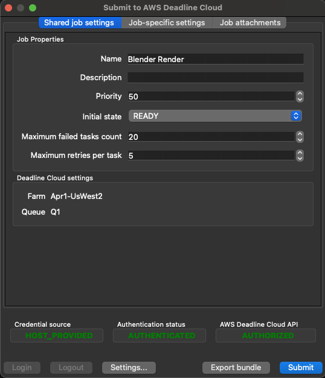
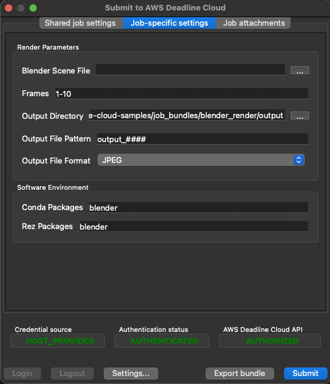
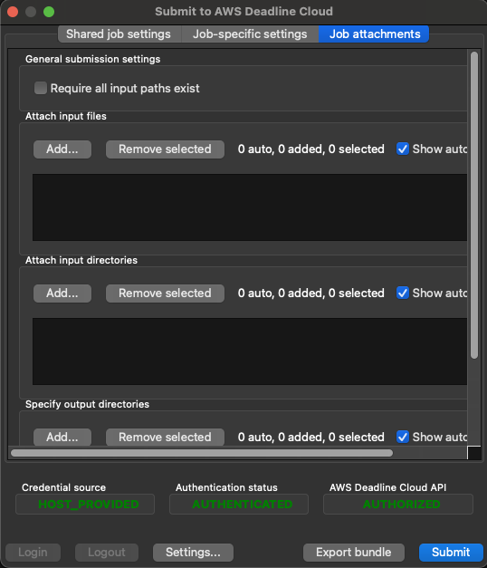
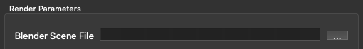
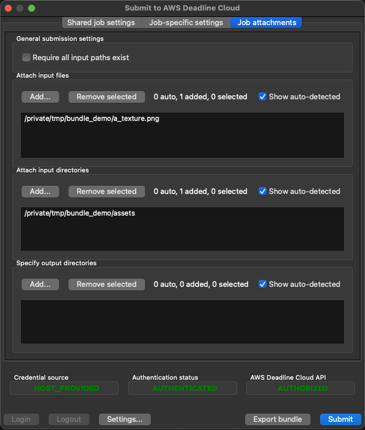

# AWS Deadline Cloud Job Bundles

Job Bundles are one of the tools that you can use to define your Jobs for Amazon Deadline Cloud. They encapsulate
an [Open Job Description Job Template](https://github.com/OpenJobDescription/openjd-specifications/wiki) into a directory
with additional information such the files and directories that your Jobs need for
Deadline Cloud's [Job Attachments](https://docs.aws.amazon.com/deadline-cloud/latest/userguide/storage-job-attachments.html)
feature. The [Deadline Cloud CLI](https://github.com/aws-deadline/deadline-cloud) provides ways for you to use a Job Bundle
to submit Jobs to your Deadline Cloud Queues to be run.

We recommend developing your own Job Bundle(s), either by-hand or programatically, for your custom Job submission needs. 
By using a Job Bundle with the Deadline Cloud CLI you can easily make use of Deadline Cloud's Job Attachments feature,
and an intuitive graphical Job submission interface. For example, after 
[configuring the Deadline Cloud CLI](https://github.com/aws-deadline/deadline-cloud/blob/mainline/README.md#configuration) 
you can run it with the Blender sample in this samples directory (`deadline bundle gui-submit blender_render/`) to see:

   

where the contents of the Job-specific settings panel are automatically generated using the `userInterface` properties of Job Parameters
[defined in the Job Template](https://github.com/aws-deadline/deadline-cloud-samples/blob/bdd5ff5ea29eb7457c9a78ba39166b891b79151e/job_bundles/blender_render/template.yaml#L11-L19) within 
your Job Bundle, and the [Queue Environments](https://docs.aws.amazon.com/deadline-cloud/latest/userguide/create-queue-environment.html)
defined on the Queue that you are submitting to.

All of the Job submitter plugins that have been developed by the AWS Deadline Cloud team, such as the 
[Autodesk Maya plugin](https://github.com/aws-deadline/deadline-cloud-for-maya), are simply generating a Job Bundle for your
Job submission then using the [Deadline Cloud Python package](https://github.com/aws-deadline/deadline-cloud) 
submit your Job to Deadline Cloud. You can see the Job Bundles that are
submitted by looking in the job history directory on your workstation after submitting a Job using a submitter plugin or the Deadline
Cloud CLI. You can find your job history directory by running the command: `deadline config get settings.job_history_dir`.

## Elements of a Job Bundle

A Job Bundle is a directory structure that contains at least an
[Open Job Description Job Template](https://github.com/OpenJobDescription/openjd-specifications/wiki) file, but may contain
other files as follows:

```
/template.json (or template.yaml)
/asset_references.json (or asset_references.yaml)
/parameter_values.json (or parameter_values.yaml)
<plus any other Job-specific files that you'd like>
```

The only required file is the Job Template (`template.json`/`template.yaml`) file that describes the structure and behaviour
of your Job. The remaining files are optional, and are described in the following subsections.

### Elements - Job Template

The `template.json`/`template.yaml` file defines the runtime environment and all the processes that will run
as part of an Amazon Deadline Cloud Job. It can be parameterized so that the same template can be used to
create Jobs that differ only in their input values; much like a function or template in your favourite programming
langauge. 

For example, the [Job Template for the `blender_render` sample](https://github.com/aws-deadline/deadline-cloud-samples/blob/mainline/job_bundles/blender_render/template.yaml)
defines input parameters like `BlenderSceneFile` which is a file path:

```yaml
- name: BlenderSceneFile
  type: PATH
  objectType: FILE
  dataFlow: IN
  userInterface:
    control: CHOOSE_INPUT_FILE
    label: Blender Scene File
    groupLabel: Render Parameters
    fileFilters:
    - label: Blender Scene Files
      patterns: ["*.blend"]
    - label: All Files
      patterns: ["*"]
  description: >
    Choose the Blender scene file you want to render. Use the 'Job Attachments' tab
    to add textures and other files that the job needs.
```

The Job Parameter properties `userInterface`, `objectType`, and `dataFlow` are used by the Deadline Cloud CLI when
present in a Job Template within a Job Bundle. 

The `userInterface` properties control the behaviour of automatically generated Job submission UIs; both via 
the `deadline bundle gui-submit` command line, and within Job submittion plugins for applications
such as the [Autodesk Maya plugin](https://github.com/aws-deadline/deadline-cloud-for-maya). 
In this example, the UI widget for inputting a value for `BlenderSceneFile` will be a file-selection dialog that
allows filtering to see only Blender's `.blend` files or all files, and within a widget group called "Render Parameters":



The `objectType` and `dataFlow` properties control the behaviour of Deadline Cloud's 
[Job Attachments feature](https://docs.aws.amazon.com/deadline-cloud/latest/userguide/storage-job-attachments.html) when submitting
a Job from the Job Bundle. In this case, `objectType: FILE` and `dataFlow: IN` mean that the value of `BlenderSceneFile`
will be treated as an input file for Job Attachments. Contrast that with the definition of the `OutputDir` which has
`objectType: DIRECTORY` and `dataFlow: OUT`:

```yaml
- name: OutputDir
  type: PATH
  objectType: DIRECTORY
  dataFlow: OUT
  userInterface:
    control: CHOOSE_DIRECTORY
    label: Output Directory
    groupLabel: Render Parameters
  default: "./output"
  description: Choose the render output directory.
```

The value of `OutputDir` is treated by Job Attachments as a directory where the Job is expected to write output files.

The remainder of the `blender_render` sample's Job Template defines the workflow as a single Step with each frame of the animation
being rendered as a separate Task:

```yaml
steps:
- name: RenderBlender
  parameterSpace:
    taskParameterDefinitions:
    - name: Frame
      type: INT
      range: "{{Param.Frames}}"
  script:
    actions:
      onRun:
        command: bash
        # Note: {{Task.File.Run}} is a variable that expands to the filename on the Worker host's
        # disk where the contents of the 'Run' embedded file, below, is written.
        args: ['{{Task.File.Run}}']
    embeddedFiles:
      - name: Run
        type: TEXT
        data: |
          # Configure the task to fail if any individual command fails.
          set -xeuo pipefail

          mkdir -p '{{Param.OutputDir}}'

          blender --background '{{Param.BlenderSceneFile}}' \
                  --render-output '{{Param.OutputDir}}/{{Param.OutputPattern}}' \
                  --render-format {{Param.Format}} \
                  --use-extension 1 \
                  --render-frame {{Task.Param.Frame}}
```

Additional samples of Job Templates can be found in all of the Job Bundles in this repository as well as in the 
[samples provided](https://github.com/OpenJobDescription/openjd-specifications/tree/mainline/samples)
by Open Job Description. Please see https://github.com/OpenJobDescription/openjd-specifications/wiki
for more information on Job Templates.

### Elements - Parameter Values

The `parameter_values.json`/`parameter_values.yaml` file in a Job Bundle gives you a place to "bake"
the values of some of the Job Parameters, and/or [deadline:CreateJob API](https://docs.aws.amazon.com/deadline-cloud/latest/APIReference/API_CreateJob.html)
request arguments into the Job Bundle so that the values do not have to be given when submitting a Job using the
Job Bundle. The Job Bundle submission UI that is created will still allow values for these parameters to be input.

The format of the file, in YAML, is:

```yaml
parameterValues:
- name: <string>
  value: <integer>, <float>, or <string>
- name: <string>
  value: <integer, <float>, or <string>
... repeating as necessary
```

Each element of the `parameterValues` list in the file must be either: 

1. A Job Parameter defined in the Job Bundle's Job Template; 
2. A Job Parameter defined in a Queue Environment on the Queue that you are submitting the Job to; or 
3. A special parameter that is passed to the [deadline:CreateJob API](https://docs.aws.amazon.com/deadline-cloud/latest/APIReference/API_CreateJob.html)
   when creating a Job with the Job Bundle:
    * `deadline:priority` - The value must be an integer, and is passed as the `priority` request parameter to the API.
    * `deadline:targetTaskRunStatus` - Value must be a string, and is passed as the `targetTaskRunStatus` request parameter to the API.
    * `deadline:maxFailedTasksCount` - Value must be an integer, and is passed as the `maxFailedTasksCount` request parameter to the API.
    * `deadline:maxRetriesPerTask` - Value must be an integer, and is passed as the `maxRetriesPerTask` request parameter to the API.

While a Job Template is always a template rather than a specific Job to run, the parameter values file allows
a Job Bundle to act as a template if some Job Parameters do not have values defined in this file, or as a specific job submission
if all Job Parameters have values.

For example, the [`blender_render` sample](https://github.com/aws-deadline/deadline-cloud-samples/tree/mainline/job_bundles/blender_render)
has no parameter values file, and its Job Template defines Job Parameters, like `BlenderSceneFile` and `OutputDir`, that
have no default values, so it must be used as a template from which Jobs are created. When we create a Job using this Job Bundle, with
`deadline bundle gui-submit blender_render/`, a new Job Bundle is written to the job history directory and that Job Bundle has
a `parameter_values.yaml` file that contains the values of all parameters defined for the Job submission:

```bash
% cat ~/.deadline/job_history/\(default\)/2024-06/2024-06-20-01-JobBundle-Demo/parameter_values.yaml
parameterValues:
- name: deadline:targetTaskRunStatus
  value: READY
- name: deadline:maxFailedTasksCount
  value: 10
- name: deadline:maxRetriesPerTask
  value: 5
- name: deadline:priority
  value: 75
- name: BlenderSceneFile
  value: /private/tmp/bundle_demo/bmw27_cpu.blend
- name: Frames
  value: 1-10
- name: OutputDir
  value: /private/tmp/bundle_demo/output
- name: OutputPattern
  value: output_####
- name: Format
  value: PNG
- name: CondaPackages
  value: blender
- name: RezPackages
  value: blender
```

We could recreate the exact same Job by submitting this new Job Bundle instead with: 

```
deadline bundle submit ~/.deadline/job_history/\(default\)/2024-06/2024-06-20-01-JobBundle-Demo/
```

Note: The submitted Job Bundle is saved to your "job history directory" and the location of that directory 
can be found by running `deadline config get settings.job_history_dir`.

### Elements - Asset References

The `asset_references.json`/`asset_references.yaml` file in a Job Bundle is an interface for Deadline Cloud's
Job Attachments feature that lists input files and directories, as well as output directories for the Jobs that you
submit. If you do not have all of your inputs and outputs for Job Attachments listed in this file
then you can still select them for your Job during submission with the `deadline bundle gui-submit` CLI command.
This file has no effect if you are not using Deadline Cloud's Job Attachments feature.

The format of the file and the purpose of each element is as follows:

```yaml
assetReferences:
    inputs:
        # Filenames on the submitting workstation whose file contents are needed as 
        # inputs to run the Job.
        filenames:
        - <list of file paths>
        # Directories on the submitting workstation whose contents are needed as inputs
        # to run the Job.
        directories:
        - <list of directory paths>

    outputs:
        # Directories on the submitting workstation where the Job would write output files
        # if it was running locally.
        directories:
        - <list of directory paths>

    # Paths that are referenced by the job, but not necessarily input or output.
    # Use this if your job uses the name of a path in some way, but does not explicitly need
    # the contents of that path. Any directories that are not within a Storage Profile's
    # directory will have 
    referencedPaths:
    - <list of directory paths>
```

Using the [`blender_render` sample](https://github.com/aws-deadline/deadline-cloud-samples/tree/mainline/job_bundles/blender_render) as
an example again, we create a Job with `deadline bundle gui-submit blender_render/` and provide some additional files on the Job Attachments
tab:



After submitting the Job, we can look at the `asset_references.yaml` file that was written to the Job Bundle in the job history
directory to see how the UI elements map to the fields of the file:

```bash
% cat ~/.deadline/job_history/\(default\)/2024-06/2024-06-20-01-JobBundle-Demo/asset_references.yaml 
assetReferences:
  inputs:
    filenames:
    - /private/tmp/bundle_demo/a_texture.png
    directories:
    - /private/tmp/bundle_demo/assets
  outputs:
    directories: []
  referencedPaths: []
```
