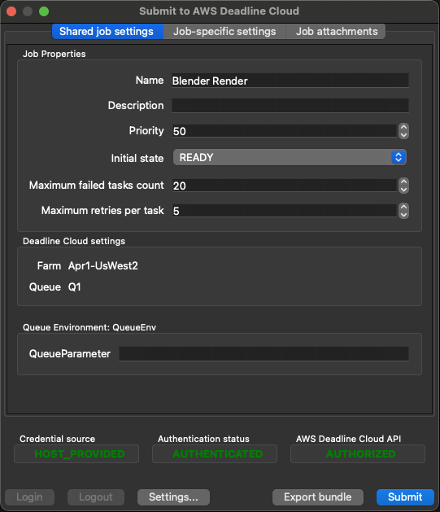
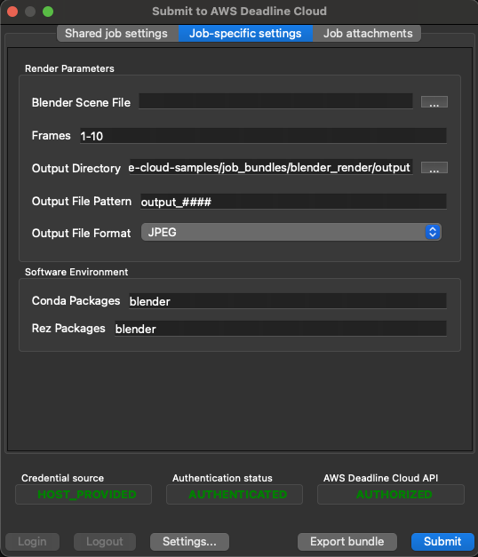
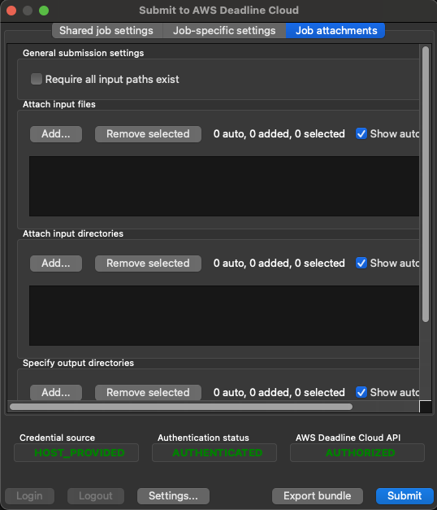

# AWS Deadline Cloud job bundles

Job bundles are the easiest way to define your jobs for AWS Deadline Cloud. They encapsulate
an [Open Job Description job template](https://github.com/OpenJobDescription/openjd-specifications/wiki) into a directory
with additional information such as the files and directories that your jobs need. Read more about
how to [build a job bundle](https://docs.aws.amazon.com/deadline-cloud/latest/developerguide/build-job-bundle.html)
in the Deadline Cloud developer guide. See the [example Blender job submission](#example-blender-job-submission) below
for more about submitting these jobs to your farm.

## Job bundle index

This table covers every immediate user-selectable sample directory or collection in `job_bundles/`.
Nested collections provide their own complete indexes where applicable.

| Sample | What it demonstrates | Start here when |
|---|---|---|
| [3ds Max V-Ray denoiser](3dsmax_vray_denoiser/) | V-Ray rendering, frame chunking, and VRIMG-to-EXR conversion with denoising data | You render 3ds Max scenes with V-Ray and need denoised EXR output |
| [After Effects one-task render](afterfx_render_one_task/) | Running an entire `aerender` frame range as one task | A composition must stay on one worker for the full render |
| [Arnold standalone render](arnold_standalone_render/) | Rendering Arnold `.ass` files with `kick` | Your scenes are already exported and do not need Maya at render time |
| [CARLA autonomous-driving simulation](autonomous_driving_carla/) | GPU container simulation, parameter sweeps, and multi-sensor capture | You want to distribute autonomous-driving scenarios |
| [Blender render](blender_render/) | A compact frame-parallel DCC render job with application packages | You need a minimal Blender or general CLI-render starting point |
| [Blender turntable to Flow](blender_turntable_to_flow/) | Rendering, encoding, thumbnail extraction, and publishing to Flow Production Tracking | You are building a render-to-review studio workflow |
| [Bash CLI job](cli_job/) | Submitting a multi-line shell script with an attached data directory | You want to run an ad hoc command-line workload |
| [Copy S3 prefix to job attachments](copy_s3_prefix_to_job_attachments/) | Distributed hashing and copying into content-addressable job attachment storage | Existing S3 datasets should be staged without workstation uploads |
| [Custom submitters](custom_submitters/) | A collection of in-application submission interfaces, including Maya | Artist context and DCC state require a custom submission UI |
| [ESMFold prediction](esmfold_predict/) | Parallel protein structure prediction, validation, and rendering | You need a GPU bioinformatics pipeline from FASTA to PDB outputs |
| [FFmpeg encode video](ffmpeg_encode_video/) | Encoding a numbered image sequence into MP4 | You need a standalone render-output encoding utility |
| [FFmpeg movie from job output](ffmpeg_movie_from_job_output/) | Downloading another job's output and encoding it downstream | Post-processing should be a separately submitted follow-up job |
| [FLUX.2 Klein LoRA](flux2_klein_lora/) | A collection for LoRA training and image generation on GPUs | You want to fine-tune FLUX.2 Klein and generate images |
| [GROMACS molecular dynamics](gromacs_md/) | Molecular-dynamics stages and scientific result visualization | You want to distribute protein simulation work |
| [Gaussian Splatting pipeline](gsplat_pipeline/) | Video-frame extraction, structure from motion, GPU training, and point-cloud output | You need a multi-step 3D reconstruction workflow |
| [GUI control showcase](gui_control_showcase/) | Every OpenJD job-parameter GUI control and UI metadata option | You are designing a bundle submission interface |
| [Houdini Husk USD render](houdini_husk_usd_render/) | USD dependency discovery and rendering with Husk/Karma | You need a concise USD render job with asset introspection |
| [Infinigen scene generation](infinigen_scene_gen/) | Procedural indoor and outdoor scene generation on GPU workers | You need synthetic photorealistic datasets |
| [Job attachments input guide](job_attachments_devguide/) | Input path metadata and attached script files | You are learning how job attachment inputs are materialized |
| [Job attachments output guide](job_attachments_devguide_output/) | Collecting declared job output files | You are learning how job attachment outputs are returned |
| [Job development progression](job_dev_progression/) | Four stages from inline commands to a tested bundled Python package | You want to grow a maintainable job without starting complex |
| [Daemon-process environment](job_env_daemon_process/) | Starting a background process once and sharing it across tasks | Application startup should be amortized within a session |
| [Environment variables](job_env_vars/) | Setting variables at job and step scope with OpenJD environments | Tasks need consistent runtime configuration |
| [Environment-provided command](job_env_with_new_command/) | Creating a command and adding it to `PATH` for job steps | Setup should expose reusable tooling to every step |
| [KeyShot standalone](keyshot_standalone/) | Frame-parallel KeyShot rendering on Windows | You render KeyShot scenes with the standalone interface |
| [List available Conda packages](list_available_conda_packages/) | Querying a Conda channel from a Deadline Cloud job | You need to inspect packages visible to workers |
| [Maya Arnold export and render](maya_arnold_ass_export_render/) | Exporting `.ass` once, then rendering frames with Arnold `kick` | You want separate DCC export and renderer-only steps |
| [Maya CLI render](maya_cli_render/) | Rendering a Maya scene with the CLI `Render` command | You need a small Maya command-line example |
| [Monte Carlo simulation](monte_carlo_simulation/) | Parallel financial simulation followed by result aggregation | You want a non-rendering fan-out/fan-in workload |
| [MuJoCo sim-to-policy](mujoco_sim_to_policy/) | Simulation data generation, policy training, and rendered evaluation | You need a multi-step robotics ML workflow |
| [Nuke render](nuke_render/) | Frame-parallel headless compositing with `nuke -x` | You need to render Nuke scripts on workers |
| [Pip package job](pip_package_job/) | Declaring Python dependencies for a pip queue environment | A shared queue environment should provide job packages |
| [Pip self-contained job](pip_self_contained_job/) | Creating and activating a pip environment inside one bundle | You cannot or do not want to configure the queue |
| [POV-Ray 3.7](povray-3.7/) | Raytracing with a Conda-provided command-line renderer | You want a portable, lightweight render example |
| [Redshift 2025](redshift-2025/) | Rendering Cinema 4D Redshift scenes with `redshiftCmdLine` | You need direct Windows Redshift command-line rendering |
| [Satellite classification](satellite_classification/) | Per-tile image classification followed by mosaic assembly | Independent input files should fan out and merge |
| [Simple job](simple_job/) | The smallest developer-guide OpenJD job bundle | You are submitting your first custom job |
| [SSH to SMF](ssh_to_smf/) | Temporary Linux SSH access through an SSM hybrid managed node | You need interactive debugging on a service-managed worker |
| [SSH to SMF on Windows](ssh_to_smf_windows/) | Temporary RDP, SSH, or PowerShell access through SSM | You need interactive debugging on a Windows worker |
| [Task chunking](task_chunking/) | A collection of contiguous and non-contiguous chunking patterns | Per-task startup overhead should be shared across frames |
| [Maya tile render blog sample](tile_render_maya_ffmpeg_for_blogpost/) | The adaptor customization and tiled-render workflow from the AWS blog | You are following the tile-rendering walkthrough |
| [Maya Arnold tiled render](tile_render_with_maya_arnold/) | A three-dimensional task space and FFmpeg tile assembly | Arnold images should render as distributed tiles |
| [Maya V-Ray tiled render](tile_render_with_maya_vray/) | V-Ray tile rendering followed by OpenImageIO assembly | You need tiled EXR output from Maya and V-Ray |
| [V-Ray Linux region render](tile_render_with_vray_linux/) | Region rendering, asset discovery, path mapping, and image merge | You render `.vrscene` files in parallel regions on Linux |
| [Maya Arnold turntable](turntable_with_maya_arnold/) | Building a scene around an OBJ, rendering frames, and encoding video | You need an easy-to-submit 3D asset review utility |
| [AutoDock Vina virtual screening](virtual_screening_vina/) | Parallel molecular docking and ranked result aggregation | You want to screen many ligands against a protein target |
| [vLLM evaluation leaderboard](vllm_lm_eval_leaderboard/) | Parallel model evaluation and final CSV/Markdown aggregation | You need to compare multiple LLMs across benchmarks |
| [V-Ray standalone render](vray_render/) | Rendering with a Conda-provided V-Ray executable | You need a basic standalone V-Ray bundle |
| [VRED render](vred_render/) | Headless VRED rendering, tiling, and Python API control | You render VRED scenes with VRED Core or Pro |
| [VTK visualization](vtk-latest/) | Running a VTK Python visualization script | You need a portable scientific visualization job |

### Developer guide companion samples

Several compact bundles are intended to be read alongside reference documentation. The [simple job](simple_job/template.yaml)
accompanies the developer guide's [developer farm walkthrough](https://docs.aws.amazon.com/deadline-cloud/latest/developerguide/getting-started-dev.html).
The [environment variables](job_env_vars/template.yaml), [environment-provided command](job_env_with_new_command/template.yaml), and
[daemon-process environment](job_env_daemon_process/template.yaml) bundles accompany [Control the job environment](https://docs.aws.amazon.com/deadline-cloud/latest/developerguide/control-the-job-environment.html)
and demonstrate [OpenJD environments](https://github.com/OpenJobDescription/openjd-specifications/wiki/2023-09-Template-Schemas#4-environment);
see the [queue environment samples](../queue_environments/) for session-wide alternatives.

The [job attachments input](job_attachments_devguide/) and [output](job_attachments_devguide_output/) bundles accompany the developer guide's
[job attachments walkthrough](https://docs.aws.amazon.com/deadline-cloud/latest/developerguide/build-job-attachments.html). They show how OpenJD
`PATH` parameter data-flow metadata and `asset_references.yaml` jointly describe inputs and outputs, allowing the same bundle patterns to work with
job attachments or shared filesystems. The [GUI control showcase](gui_control_showcase/template.yaml) is the compact reference for every control
supported by [OpenJD job-parameter UI metadata](https://github.com/OpenJobDescription/openjd-specifications/wiki/2023-09-Template-Schemas#2-jobparameterdefinition).

## Example Blender job submission

With a job bundle in hand, the [Deadline Cloud CLI](https://github.com/aws-deadline/deadline-cloud) provides ways for you
to submit jobs to run on your Deadline Cloud queues. Read more about
[how to submit a job](https://docs.aws.amazon.com/deadline-cloud/latest/developerguide/submit-jobs-how.html)
in the Deadline Cloud developer guide.

Here's the submitter GUI you can see after [configuring the Deadline Cloud CLI](https://github.com/aws-deadline/deadline-cloud/blob/mainline/README.md#configuration)
and running `deadline bundle gui-submit blender_render/` in this samples directory:

  

Alternatively, you can submit this job bundle with the command
`deadline bundle submit --name Demo -p BlenderSceneFile=<location-of-your-scene-file> -p OutputDir=<file-path-for-job-outputs> blender_render/`
or use the `deadline.client.api.create_job_from_job_bundle` function in the [`deadline` Python package](https://github.com/aws-deadline/deadline-cloud).
If you do not want to use the `deadline` Python package's support for features like job attachments, you can also submit the job template by calling the
[deadline:CreateJob API](https://docs.aws.amazon.com/deadline-cloud/latest/APIReference/API_CreateJob.html) directly.

## Example Husk USD render with asset introspection

The [Houdini Husk USD render](houdini_husk_usd_render/) sample shows how to use the Houdini Husk CLI USD renderer using a short job template and service-provided Conda packages.
It also shows how to write a custom asset introspection tool for job attachments, ensuring that only the required data is uploaded while removing manual steps for artists.
