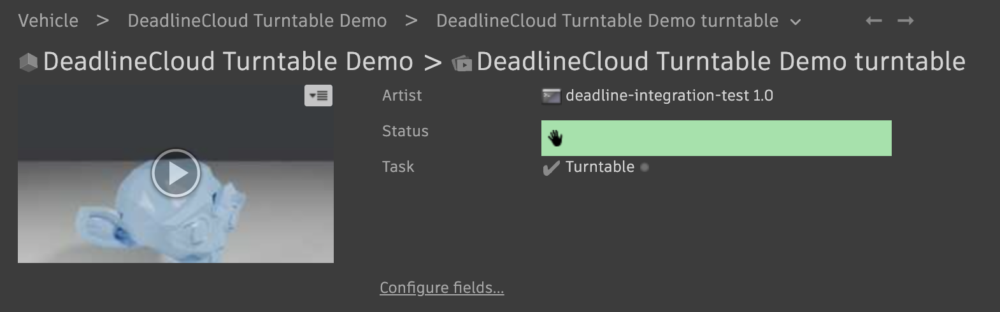

# Blender Turntable to Autodesk Flow Production Tracking

## Introduction

This job bundle renders an animated turntable in Blender and encodes it into a
review-ready movie. It also extracts a poster-frame thumbnail and publishes the
result to [Autodesk Flow Production Tracking](https://www.autodesk.com/products/flow-production-tracking/overview)
(formerly ShotGrid) as a new `Version` on an `Asset`'s review `Task`.



It is a deliberately end-to-end, representative example of a render-and-publish
pipeline on AWS Deadline Cloud, and it demonstrates two core patterns:

1. Post-render work modeled as job steps. Tasks like uploading to Flow,
   registering versions, and generating thumbnails are expressed as discrete
   steps in the job, not as side effects hidden inside the render.
2. Chained, dependent, non-render tasks (movie encode, thumbnail, publish)
   that run after a render and fan out in parallel.

## Why post-render work belongs in a job step

The canonical way to do post-render work on Deadline Cloud (uploading to Flow,
registering versions, generating thumbnails) is a discrete OpenJD step with a
step dependency. Each unit of post-render work is a first-class farm task,
which means it is:

- Observable: it shows up in the monitor with its own logs and status.
- Independently retryable: a failed Flow publish can be retried without
  re-rendering a single frame.
- Independently schedulable: the publish step can run on a cheap CPU fleet
  instead of the GPU render fleet (this sample keeps them on one fleet for
  simplicity, but the steps are separable).
- Parallelizable: `GenerateMovie` and `GenerateThumbnail` run at the same
  time because neither depends on the other.

Modeling each piece of post-render work as its own step is what gives you all of
the above, and it's the pattern to reach for when wiring a Flow publish into a
render job.

## The step graph

```
RenderTurntable          (Blender; one task per frame, parameter-space over the frame range)
   ├─ GenerateMovie       (depends: RenderTurntable)   ffmpeg frames → H.264 mp4
   ├─ GenerateThumbnail   (depends: RenderTurntable)   mid frame → jpg
   └─ PublishToFlow       (depends: GenerateMovie, GenerateThumbnail)
                          create Version, upload movie + thumbnail, advance Task
```

`GenerateMovie` and `GenerateThumbnail` both depend only on `RenderTurntable`, so
they run in parallel, a clear visual demonstration of step fan-out in the
monitor. `PublishToFlow` depends on both because it uploads both artifacts.

## How this maps to the Flow entity model

The sample follows idiomatic Flow conventions:

- The `Version` is the hero entity, the reviewable media record. The movie is
  uploaded to `sg_uploaded_movie` (what plays in the review player);
  `sg_path_to_movie` / `sg_path_to_frames` hold the filesystem paths.
- The thumbnail belongs on the `Version` (uploaded via `upload_thumbnail`),
  which populates the Version's `image` field, which shows in the review
  grid. It is not attached to the Asset.
- Status is advanced on the `Task`, not the Asset. In Flow, an Asset isn't
  marked "rendered"; instead the review Task (such as a "Model" or
  "Turntable" task) is advanced. Many studios use a `rev` ("pending review")
  status for this, but `rev` is not a stock status code and varies per site.
  The `FlowTaskStatus` parameter defaults to `fin` because the demo site only
  defines the stock codes `wtg` / `ip` / `fin`; set it to whatever your site
  uses (`rev` is the conventional choice where it exists).
- The work hangs off an Asset rather than a Shot. An "Asset turntable" (build
  an asset, render a turntable to review the model or look) is self-contained,
  with no sequence/shot hierarchy required, and maps directly to "render an
  object and review it."

## Prerequisites

The job needs Blender, FFmpeg, and Python. On Deadline Cloud
service-managed fleets, use a [conda queue
environment](https://docs.aws.amazon.com/deadline-cloud/latest/developerguide/provide-applications.html)
with:

- `CondaPackages`: `blender ffmpeg python>=3.10 pip`
- `CondaChannels`: `deadline-cloud conda-forge`

Blender is on the `deadline-cloud` channel; FFmpeg is on the `conda-forge`
community channel.

The Flow Python client `shotgun_api3` is published on PyPI
only (it is not on conda-forge). The `PublishToFlow` step
`pip install`s `shotgun_api3` (and `boto3`) at runtime into the conda
environment. This mixed conda + pip approach is normal for Python client
libraries that have no conda package. A team that wants fully reproducible,
offline-capable environments can instead build an internal conda package or
bake the dependency into a custom worker image.

## Flow credentials: AWS Secrets Manager (do this once)

Flow script credentials are stored in AWS Secrets Manager. The `PublishToFlow`
step reads them at runtime using the worker's queue role, so the credentials
stay out of the job bundle and out of the job's parameters.

### 1. Create the secret

The secret value is JSON holding your Flow site URL, the script
name (from Flow → Admin → Scripts), and its API key:

```bash
aws secretsmanager create-secret \
  --region us-west-2 \
  --name "deadline-cloud-samples/flow-production-tracking" \
  --description "Flow Production Tracking script credentials for the turntable demo job." \
  --secret-string '{
    "site_url": "https://your-site.shotgrid.autodesk.com",
    "script_name": "your-script-name",
    "api_key": "your-api-key"
  }'
```

Note the returned `ARN`. You'll pass it as the `FlowSecretArn` job parameter.

To update the credentials later:

```bash
aws secretsmanager put-secret-value \
  --region us-west-2 \
  --secret-id "deadline-cloud-samples/flow-production-tracking" \
  --secret-string '{ "site_url": "...", "script_name": "...", "api_key": "..." }'
```

### 2. Grant the queue role permission to read the secret

The job runs under your queue role (the `roleArn` on your queue). That role
must be allowed `secretsmanager:GetSecretValue` on the secret ARN. Find the role
name:

```bash
aws deadline get-queue \
  --region us-west-2 \
  --farm-id farm-XXXX --queue-id queue-XXXX \
  --query roleArn --output text
# e.g. arn:aws:iam::<account>:role/service-role/AWSDeadlineCloudQueueRole-XXXXXXXX
```

Attach an inline policy granting read access to just this secret (replace the
role name and ARN):

```bash
aws iam put-role-policy \
  --role-name AWSDeadlineCloudQueueRole-XXXXXXXX \
  --policy-name FlowProductionTrackingSecretRead \
  --policy-document '{
    "Version": "2012-10-17",
    "Statement": [
      {
        "Sid": "ReadFlowProductionTrackingSecret",
        "Effect": "Allow",
        "Action": "secretsmanager:GetSecretValue",
        "Resource": "arn:aws:secretsmanager:us-west-2:<account>:secret:deadline-cloud-samples/flow-production-tracking-XXXXXX"
      }
    ]
  }'
```

> Scope the `Resource` to the exact secret ARN (including the random suffix
> Secrets Manager appends). Do not grant `secretsmanager:GetSecretValue` on `*`.

## Bundle layout

```
blender_turntable_to_flow/
├── template.yaml                the OpenJD job template
├── hooks.yaml                   submission hook configuration (preSubmission)
└── scripts/
    ├── build_turntable.py       builds the turntable scene in Blender and renders a frame
    ├── publish_to_flow.py       creates the Version and uploads the movie + thumbnail
    └── flow_params_from_env.py  preSubmission hook: fills the Flow parameters from the environment
```

The render and publish scripts are referenced by the template as `dataFlow: IN`
`PATH` parameters (`BuildTurntableScript`, `PublishScript`). Deadline Cloud
uploads them with the job's attachments and path-maps them onto the worker, so
the steps run them as ordinary files rather than embedding the source inline.

## Filling Flow parameters from the environment (submission hook)

Studios often already have environment or project-tracking tooling that sets
environment variables when an artist opens a shell or launches an application
(via Rez, a launcher, a "set project" script, and so on). This bundle uses a
[Deadline Cloud submission hook](https://github.com/aws-deadline/deadline-cloud/blob/mainline/docs/submission-hooks.md)
to read those variables and fill in the job's Flow parameters, so the
submitting artist doesn't re-enter the project id, asset name, secret ARN, etc.
by hand.

The Flow parameters in the template are `HIDDEN` and carry only placeholder
defaults. `hooks.yaml` registers a `preSubmission` hook
(`scripts/flow_params_from_env.py`) that runs as part of every submission (CLI
or GUI) and rewrites those parameter defaults from the environment before the
job is created.

| Environment variable | Job parameter | Required |
|----------------------|---------------|----------|
| `FLOW_PROJECT_ID` | `FlowProjectId` | yes |
| `FLOW_ASSET_NAME` | `FlowAssetName` | yes |
| `FLOW_SECRET_ARN` | `FlowSecretArn` | yes |
| `FLOW_ASSET_TYPE` | `FlowAssetType` | no |
| `FLOW_STEP_SHORT_NAME` | `FlowStepShortName` | no |
| `FLOW_TASK_NAME` | `FlowTaskName` | no |
| `FLOW_TASK_STATUS` | `FlowTaskStatus` | no |
| `FLOW_PUBLISH` | `EnableFlowPublish` | no |

If a required variable is missing, the hook exits non-zero and the submission is
aborted with a message telling you which variables to set. To submit without
publishing (render → movie → thumbnail only), set `FLOW_PUBLISH=FALSE`; the
required-variable check is then skipped.

Bundle hooks are disabled by default. Enable them once:

```bash
deadline config set settings.allow_bundle_hooks true
```

With the hook in place, a submission only needs the render parameters. The Flow
parameters come from the environment:

```bash
# A studio "set project" step would normally export these for you:
export FLOW_PROJECT_ID=1234
export FLOW_ASSET_NAME="Hero Vehicle"
export FLOW_SECRET_ARN=arn:aws:secretsmanager:us-west-2:<account>:secret:deadline-cloud-samples/flow-production-tracking-XXXXXX

deadline bundle submit blender_turntable_to_flow/ -p ObjectShape=monkey -p FrameRange=1-48
```

The hook reads and writes the template with PyYAML, so the Python that runs it
(the Deadline Cloud CLI's Python) needs `pyyaml` available.

## Example submission

These examples assume the `FLOW_*` environment variables are set (see the
previous section) and bundle hooks are enabled.

### GUI submission

```bash
deadline bundle gui-submit blender_turntable_to_flow/
```

### CLI submission

```bash
deadline bundle submit blender_turntable_to_flow/ \
  -p ObjectShape=monkey \
  -p FrameRange=1-48
```

### Render-only (no Flow)

To exercise just the render → movie → thumbnail pipeline without Flow
credentials, set `FLOW_PUBLISH=FALSE` so the hook skips the required-variable
check and the publish step is skipped:

```bash
FLOW_PUBLISH=FALSE deadline bundle submit blender_turntable_to_flow/ \
  -p ObjectShape=torus
```

## Parameters

| Parameter | Default | Description |
|-----------|---------|-------------|
| ObjectShape | `monkey` | Procedural subject: monkey, cube, torus, ico_sphere, cylinder, cone |
| FrameRange | `1-48` | Frame range; a full 360° rotation is spread across it |
| ResolutionX / ResolutionY | `960` / `540` | Render resolution |
| Samples | `48` | Cycles render samples |
| OutputDir | `output` | Working/output dir; frames in `OutputDir/frames`, movie+thumbnail in `OutputDir` |
| FrameRate | `24` | Output movie fps |
The Flow parameters below are `HIDDEN` and supplied by the preSubmission hook
from the `FLOW_*` environment variables; the "default" column is only the
template placeholder.

| Parameter | Default | Description |
|-----------|---------|-------------|
| EnableFlowPublish | `TRUE` | `FALSE` (via `FLOW_PUBLISH`) skips the Flow publish step |
| FlowSecretArn | *(empty)* | Secrets Manager ARN holding `{site_url, script_name, api_key}` |
| FlowProjectId | `0` | Numeric Flow Project id to publish into |
| FlowAssetName | *(empty)* | Asset code (found-or-created) |
| FlowAssetType | `Prop` | `sg_asset_type` used if the Asset is created |
| FlowStepShortName | `MDL` | Pipeline Step short name for the review Task (if created) |
| FlowTaskName | `Turntable` | Task content/name on the Asset (found-or-created) |
| FlowTaskStatus | `fin` | Status set on the Task after publishing (`rev` where defined) |
| BuildTurntableScript | `scripts/build_turntable.py` | Blender scene/render script included in the bundle (hidden) |
| PublishScript | `scripts/publish_to_flow.py` | Flow publish script included in the bundle (hidden) |
