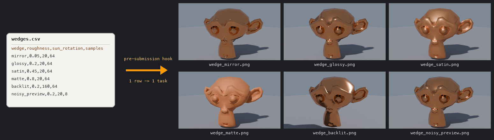

# Blender wedge render from a CSV file

This job bundle renders a wedge — a set of look-development variations of the same Blender scene,
one image per variation — where the variations are rows of a CSV file. Choose it when a spreadsheet
defines your job's task list: wedge variations, shot lists, simulation parameter sweeps, per-asset
QC checks, and similar structured data that does not fit a numeric frame range.



## What this sample demonstrates

A [pre-submission hook](https://github.com/aws-deadline/deadline-cloud/blob/mainline/docs/submission-hooks.md)
that lives inside the job bundle and expands the CSV into the job's task parameters at submission
time, so each CSV row becomes one task on the farm. The CSV is the artist-facing interface, and the
hook translates it into Open Job Description task parameters — no template editing per wedge. Unlike
the workstation-wide [submission hook samples](../../submission_hooks/), the hook here is bundle-local:
it ships with the job in `hooks.yaml` and applies only to this bundle's submissions.

## Prerequisites

- [Deadline Cloud CLI](https://github.com/aws-deadline/deadline-cloud) >= 0.58.0
  (submission hooks with template modification support), with PyYAML available
  to `python3` (`pip install pyyaml`)
- A farm and queue with a Conda queue environment that provides the `blender`
  package (the default `CondaPackages` job parameter), such as the
  [Conda queue environment sample](../../queue_environments/)
- Bundle hooks enabled once per workstation:

  ```console
  deadline config set settings.allow_bundle_hooks true
  ```

The hook runs `python3`. On Windows, or if only `python` is on your PATH, edit
the `command` in [`hooks.yaml`](hooks.yaml) accordingly.

## How it works

The wedge CSV has one row per variation:

```csv
wedge,roughness,sun_rotation,samples
mirror,0.05,20,64
glossy,0.2,20,64
satin,0.45,20,64
matte,0.8,20,64
backlit,0.2,160,64
noisy_preview,0.2,20,8
```

The job template's `RenderWedge` step declares one task parameter per CSV
column, with placeholder single-value ranges, and zips them together with a
[combination expression](https://github.com/OpenJobDescription/openjd-specifications/wiki/2023-09-Template-Schemas#34-parameterspacedefinition):

```yaml
parameterSpace:
  combination: "(WedgeName, Roughness, SunRotation, Samples)"
  taskParameterDefinitions:
  - name: WedgeName
    type: STRING
    range: [placeholder]
  # ... Roughness, SunRotation, Samples ...
```

Without the `combination` expression, OpenJD would build the cross product of
all parameter values. The associative `(A, B, C, D)` form instead pairs the
Nth value of every range together, which is exactly a CSV's row structure.

At submission time, the pre-submission hook
([`scripts/expand_wedge_csv.py`](scripts/expand_wedge_csv.py), configured in
[`hooks.yaml`](hooks.yaml)) receives the submission metadata as JSON on stdin,
reads the CSV named by the `WedgeCsvFile` job parameter, validates it, and
replaces each placeholder range with the corresponding CSV column:

```yaml
  - name: WedgeName
    type: STRING
    range: [mirror, glossy, satin, matte, backlit, noisy_preview]
  - name: Roughness
    type: FLOAT
    range: [0.05, 0.2, 0.45, 0.8, 0.2, 0.2]
  # ...
```

The hook prints the modified template on stdout under the `template` key, and
the Deadline Cloud client uses it for the CreateJob call. The bundle's
`template.yaml` on disk is never modified, and the CSV itself is uploaded with
the job (it is a `dataFlow: IN` path parameter) as a record of what was
requested.

If the CSV is missing, empty, has malformed values, or duplicate wedge names,
the hook exits non-zero and the submission is aborted before anything is
uploaded.

Each task then builds the same procedural scene — a metallic Suzanne on a
ground plane under a sun lamp — with that row's values applied
([`scripts/render_wedge.py`](scripts/render_wedge.py)). Building the scene
procedurally keeps every task fully independent and the sample self-contained;
there is no `.blend` file to ship. In a production wedge the same task
parameters would instead be applied to your scene file with a `--python-expr`
override or a small driver script.

```text
blender_wedge_from_csv/
├── template.yaml               # Job template with placeholder task parameter ranges
├── hooks.yaml                  # Bundle hook configuration
├── wedges.csv                  # The wedge definitions (one row per task)
└── scripts/
    ├── expand_wedge_csv.py     # Pre-submission hook: CSV rows -> task parameters
    └── render_wedge.py         # Blender script: builds the scene, renders one wedge
```

## Run or submit

From this directory:

```console
deadline bundle submit .
```

The CLI asks for confirmation before running the bundle's hooks, then the hook
reports what it expanded:

```text
  [pre-submission hook 1] Expanded 6 wedge row(s) from wedges.csv into 'RenderWedge'
  task parameters: mirror, glossy, satin, matte, backlit, noisy_preview
```

To wedge your own values, edit `wedges.csv` — or keep several CSVs and pick one
at submission:

```console
deadline bundle submit . -p WedgeCsvFile=/path/to/my_wedges.csv
```

GUI submission works too (`deadline bundle gui-submit .`); the CSV chosen in
the file picker is the one the hook expands.

When the job finishes, download the images with:

```console
deadline job download-output --job-id <job-id>
```

### Run it locally

You can verify the full expansion + render flow without a farm, using the
[Open Job Description CLI](https://github.com/OpenJobDescription/openjd-cli)
and a local Blender install. Simulate what the submission hook does, writing
the expanded template to a file:

```console
echo '{"jobBundleDir": "'$PWD'"}' | python3 scripts/expand_wedge_csv.py \
    | python3 -c 'import json,sys; print(json.load(sys.stdin)["template"])' \
    > /tmp/expanded_template.yaml
```

Then render one wedge from it:

```console
openjd run /tmp/expanded_template.yaml --step RenderWedge \
    --tasks '[{"WedgeName": "noisy_preview", "Roughness": 0.2, "SunRotation": 20.0, "Samples": 8}]' \
    -p WedgeCsvFile=$PWD/wedges.csv \
    -p RenderWedgeScript=$PWD/scripts/render_wedge.py \
    -p OutputDir=/tmp/wedge_out
```

Omit `--tasks` to render all six wedges sequentially.

## Parameters and outputs

| Parameter | Default | Description |
|---|---|---|
| `WedgeCsvFile` | `wedges.csv` | CSV with one wedge per row; required columns `wedge`, `roughness`, `sun_rotation`, `samples` (extra columns are ignored) |
| `OutputDir` | `output` | Directory where the wedge images are written |
| `ResolutionX` / `ResolutionY` | 960 / 540 | Render resolution in pixels |
| `CondaPackages` | `blender` | Packages for a Conda queue environment to provide |

Each CSV row produces one image, `<OutputDir>/wedge_<name>.png`, applied as:

| CSV column | Applied as |
|---|---|
| `wedge` | Output image name, `wedge_<name>.png` (letters, digits, `_`, `.`, and `-` only) |
| `roughness` | Principled BSDF roughness on the subject's material |
| `sun_rotation` | Sun lamp rotation around the vertical axis, in degrees |
| `samples` | Cycles sample count (denoising off, so sample wedges stay visible) |

## Security, cost, and cleanup

Bundle hooks execute local scripts from the job bundle at submission time, which is why they are
disabled by default and gated behind the `settings.allow_bundle_hooks` setting plus a per-submission
confirmation prompt. Review [`hooks.yaml`](hooks.yaml) and the hook script — as you should for any
bundle — before enabling. The hook here reads only the wedge CSV and the bundle's own template, and
modifies nothing on disk.

Submitting the job runs Blender render tasks on your farm's fleet and stores job attachments in your
queue's S3 bucket; both are billable at your farm's normal rates. The default CSV renders six small
images and completes in a few minutes on a single worker. There are no resources to clean up beyond
normal job attachment lifecycle in your S3 bucket.

## Troubleshooting

| Symptom | Cause | Fix |
|---|---|---|
| Hooks confirmation never appears and the job has one task | Bundle hooks not enabled | `deadline config set settings.allow_bundle_hooks true` |
| `expand_wedge_csv: CSV file ... missing required column(s)` | Header row does not match the expected schema | Match the column names in `wedges.csv`, or update `CSV_TO_TASK_PARAMETER` in the hook |
| Submission aborts with a CSV error | Malformed value, duplicate wedge name, or empty CSV | The stderr message names the file, line, and column to fix |
| Hook fails with `ModuleNotFoundError: yaml` | PyYAML not installed for `python3` | `pip install pyyaml` |
| Tasks fail with `blender: command not found` | Queue has no Conda environment providing `blender` | Attach a [Conda queue environment](../../queue_environments/) or adjust `CondaPackages` |

Task logs are available per task in the Deadline Cloud monitor; the hook's own output appears in the
submission console before upload begins.

## Adapting the pattern

To wedge different values, change all three layers together — they are coupled
by name:

1. **CSV columns** — the artist-facing schema.
2. **`CSV_TO_TASK_PARAMETER`** in `expand_wedge_csv.py` — maps each column to a
   task parameter name and type.
3. **Task parameters** in `template.yaml` — one definition per column, all
   listed in the `combination` expression, plus wiring the value into the
   render command.

Notes and limits:

- Open Job Description allows at most 1024 values per task parameter range and
  16 task parameters per step; the hook enforces the former.
- The hook trusts the CSV's header names, not column order, and ignores extra
  columns — so artists can annotate rows with notes columns freely.
- Values a hook emits for `PATH`-typed *job* parameters on stdout must be
  absolute paths; this sample only rewrites *task* parameter ranges inside the
  template, which has no such restriction.

## Related resources

- [Submission hooks documentation](https://github.com/aws-deadline/deadline-cloud/blob/mainline/docs/submission-hooks.md)
- [Workstation-wide submission hook samples](../../submission_hooks/) — the same mechanism deployed studio-wide via `DEADLINE_HOOKS_DIR`
- [Blender turntable to Flow](../blender_turntable_to_flow/) — a bundle hook that fills job parameters from studio environment variables
- [Blender render](../blender_render/) — the minimal frame-range Blender bundle this sample builds on
- [OpenJD parameter space and combination expressions](https://github.com/OpenJobDescription/openjd-specifications/wiki/2023-09-Template-Schemas#34-parameterspacedefinition)
