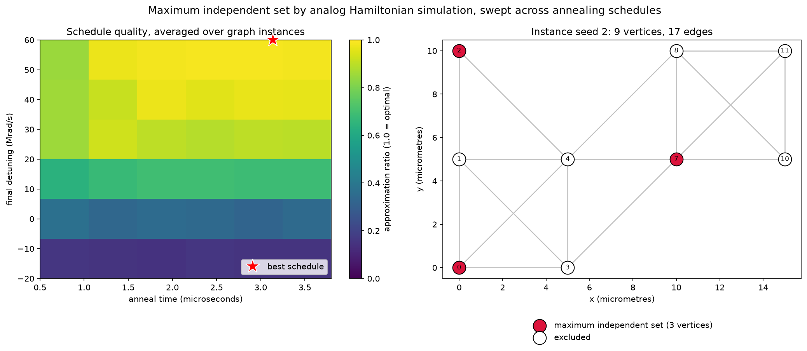

# Quantum maximum independent set sweep

This sample attacks a hard graph problem with a quantum simulator, and uses
Deadline Cloud to run hundreds of those attempts in parallel.

The problem is **maximum independent set**: choose the largest group of vertices
in a graph such that no two chosen vertices are connected by an edge. The graphs
here are **unit-disk graphs**, meaning each vertex is a point in a plane and two
vertices share an edge whenever they fall within a fixed distance of each other.
That geometry is what makes the problem a good fit for analog quantum hardware,
because an arrangement of neutral atoms has the same structure: two atoms sitting
too close together cannot both be excited.

**Amazon Braket** is the AWS quantum computing service. This sample uses the
Braket SDK and the free local Analog Hamiltonian Simulation simulator that ships
with it, so the sweep itself costs no quantum spend and needs no Braket IAM
permissions. Sweeping on the simulator first is the point of the exercise: once
the map shows which schedules work, those are the schedules worth submitting to
real Rydberg hardware such as QuEra Aquila through Braket. Read
[The physics, briefly](#the-physics-briefly) and [Costs](#costs) first, because
the hardware limits here have not been validated against a live device.

The quality of the answer depends on the **annealing schedule**, the recipe for how
the simulated lasers change over time. This job sweeps a grid of anneal times and
final detunings across several random graph instances, then a dependent step
averages the sweep and writes a map showing which schedules solve the problem.



## New to analog quantum computing?

Skip to [What this sample demonstrates](#what-this-sample-demonstrates) if maximum
independent set and Analog Hamiltonian Simulation are already familiar. Every term
in bold or italics below is also defined in the [Glossary](#glossary).

**Why the problem is hard.** Think of choosing the most sites from a list of
candidate cell towers, where two towers close enough to interfere cannot both be
chosen. Finding the true maximum is NP-hard, so the search space grows explosively
with the number of vertices.

**The machine.** Analog Hamiltonian Simulation is not gate-based quantum
computing. There are no circuits and no qubit gates. Neutral atoms are held in an
optical trap and lasers drive the whole array continuously, so you program a laser
schedule rather than a sequence of gates. The atom positions encode the graph and
the physics performs the search.

**Why that solves this problem.** Two atoms closer together than the Rydberg
blockade radius cannot both be excited at the same time, which is exactly the
independent set constraint enforced by physics instead of by a solver. Arrange the
atoms so that graph edges correspond to pairs inside the blockade radius, and the
excited atoms in any final state form an independent set.

**The two knobs this sample sweeps.**

- **Anneal time**, in microseconds, is how slowly the laser schedule changes.
  Change it slowly enough and the system stays in its lowest energy state, which
  is the largest independent set. Rush it and the system is left behind in a worse
  state.
- **Final detuning**, in Mrad/s, is how strongly the schedule rewards exciting
  atoms by the end. Too low and few atoms are excited, giving a small set. Too
  high and the system is pushed toward states that violate the blockade.

Neither knob has an obvious best value, and the best setting depends on the graph.
Sweeping a grid of both is the reason this workload has hundreds of independent
tasks to hand to a fleet.

**Reading the results.** Each task runs its schedule many times. One run is a
*shot*, and each shot returns one measured arrangement of excited atoms. The
*approximation ratio* is the size of the set found divided by the true optimum
from an exact classical solver, so 1.0 means the schedule found the best possible
answer. In the figure above, the left panel is the approximation ratio across the
swept grid, where brighter cells are better schedules, and the right panel is a
single solved instance with the chosen atoms highlighted.

## What this sample demonstrates

- A non-rendering scientific workload on Deadline Cloud, with no container and
  no custom worker image.
- A three-dimensional task parameter space (`AnnealIndex * DetuningIndex *
  GraphSeed`) whose size is controlled by job parameters, so changing the grid
  resolution in the submitter changes the task count.
- Fan-in with `dependencies`, where one aggregation step runs after every
  simulation succeeds.
- Progress and status reporting to the Deadline Cloud monitor through the
  `openjd_progress` and `openjd_status` stdout messages.
- Results validated against ground truth. Every task also solves its instance
  exactly with a classical solver, so the reported approximation ratio is
  measured rather than assumed.

Every simulation runs on the free local AHS simulator bundled with the Braket
SDK. The job submits nothing to Amazon Braket, so it needs no Braket IAM
permissions and incurs no quantum hardware charges.

## Why the workload parallelizes well

Braket's own maximum independent set example tunes the annealing schedule with a
Nelder-Mead optimizer, which is inherently sequential because each step depends
on the previous one. Replacing the optimizer with a grid search over schedules
turns one serial loop into hundreds of independent simulations, which is what
makes a fleet useful here.

Note that Braket program sets, which pack up to 100 circuits into a single
quantum task, do not apply to Analog Hamiltonian Simulation. Fan-out across
workers is the only way to parallelize this paradigm.

## The physics, briefly

Each graph vertex is a neutral atom in an optical trap. Atoms closer together
than the Rydberg blockade radius cannot both be excited, so the geometry of the
atom arrangement becomes the edge set of a unit-disk graph. Sweeping the global
detuning from strongly negative to positive rewards excitations while the
blockade forbids adjacent ones, so the system anneals toward a large independent
set.

Longer anneals track the ground state more closely, which is visible in the
output as increasing approximation ratio along the anneal time axis.

The waveform values are chosen to sit inside QuEra Aquila's limits as published
in the Braket documentation: Rabi frequency below 1.58e7 rad/s, detuning within
1.25e8 rad/s, total time below 4 microseconds, and 4 micrometre minimum atom
spacing. Those bounds have not been checked against a live `GetDevice` response,
and hardware capabilities change, so treat hardware compatibility as untested
rather than guaranteed. The sample runs only the local simulator. See
[Costs](#costs).

## Validation

The sweep is only worth running if its numbers mean something, so
`scripts/validate.py` establishes that in four independent layers:

```bash
python scripts/validate.py
```

| Layer | What it proves |
|---|---|
| Reference reproduction | Reruns the published 1D Z2 ordered-phase result from Braket's notebook 02 and compares against externally measured values. Reproduces the modal state `rgrgrgrgr` at 428/1000 and the per-site densities to within 0.0000. Validates the simulator build and the shot decoding. |
| Graph correspondence | Confirms the blockade radius at 5 micrometre spacing blockades nearest (5.00 um) and diagonal (7.07 um) neighbours but not next-nearest (10.00 um), so the graph being scored is the graph the Hamiltonian implements. |
| Classical baseline | Checks the networkx solver against exhaustive enumeration across 30 instances. |
| End to end | Confirms a long anneal at positive detuning recovers the proven optimum in a majority of shots, and that negative detuning does not. The second half is a falsification control: it shows the metric can fail. |

A fifth and stronger check verifies the dynamics themselves:

```bash
python scripts/verify_dynamics.py
```

The annealing schedule used here matches no published example, so the sweep
cannot be compared against reference numbers point by point. Rather than rely on
that, `verify_dynamics.py` reads the Analog Hamiltonian Simulation program the
job actually submits, rebuilds the Rydberg Hamiltonian from first principles,
integrates the Schrodinger equation with scipy, and compares the result against
the Braket local simulator. Two independent implementations of the same physics
agreeing is stronger evidence than matching a third party's parameters.

Measured agreement at 40,000 shots, where multinomial shot noise is about 0.005:

| Case | Max per-atom density error | Distribution total variation |
|---|---|---|
| 7 atoms, 3.8 us anneal, +60 Mrad/s | 0.00078 | 0.00218 |
| 7 atoms, 0.8 us anneal, +60 Mrad/s | 0.00528 | 0.01397 |
| 7 atoms, 3.8 us anneal, -20 Mrad/s | 0.00248 | 0.00578 |
| 8 atoms, 2.4 us anneal, +30 Mrad/s | 0.00209 | 0.00724 |

The cases deliberately span long and short anneals and both signs of final
detuning, so the agreement is not limited to a regime where the answer is
trivial.

The check is capped at 8 atoms because an exact state vector integration costs
2^N. It validates the Hamiltonian construction and the schedule, which are
independent of instance size.

## Prerequisites

- A Deadline Cloud farm with a queue and an associated **Linux** fleet. A
  service-managed fleet works without any extra setup. The workload is CPU only
  and needs no GPU, so the default instance types are fine.
- A **Conda queue environment** on the queue. The default conda queue
  environment created by the Deadline Cloud console works as is. See
  [queue_environments](../../queue_environments) for alternatives.
- The Deadline Cloud CLI: `pip install deadline`.
- To run locally instead, `pip install openjd-cli amazon-braket-sdk networkx matplotlib`.

No conda recipe is required. Both `amazon-braket-sdk` and
`amazon-braket-default-simulator` are published on conda-forge.

## How it works

| Step | What it does |
|---|---|
| `SweepSchedules` | One task per `(anneal time, final detuning, graph instance)` combination. Builds the instance, solves it exactly with networkx, runs the analog simulation, scores the shots, and writes one JSON file. |
| `AggregateResults` | Depends on `SweepSchedules`. Averages the approximation ratio across graph instances, renders the two-panel figure, and writes `summary.json`. |

Task count is `AnnealPoints * DetuningPoints * GraphInstances`. The default grid
of 6 by 6 by 4 produces 144 simulation tasks plus 1 aggregation task.

Deadline Cloud downloads the sweep step's outputs as inputs to the aggregation
step, so the fan-in needs no explicit Amazon S3 plumbing.

## Run it

Validate and run a single task locally first:

```bash
openjd check template.yaml
openjd summary template.yaml

openjd run template.yaml \
  --step SweepSchedules \
  --task-param AnnealIndex=3 --task-param DetuningIndex=6 --task-param GraphSeed=1 \
  -p ResultsDir=/tmp/mis -p TimeSteps=100
```

Then submit the full sweep:

```bash
deadline bundle gui-submit braket_mis_sweep
```

or without the GUI:

```bash
deadline bundle submit braket_mis_sweep
```

Retrieve the figure and the summary:

```bash
deadline job download-output --job-id <JOB_ID>
```

## Iterating on the sweep

Three loops, cheapest first. Most work happens in the first one.

### Loop 1: change parameters

No file edits and no upload. Everything below is a job parameter, settable in
the submitter GUI or with `-p`:

```bash
deadline bundle submit . \
  -p AnnealPoints=12 -p DetuningPoints=12 -p GraphInstances=8 \
  -p ExtraSolverArgs="--blockade-radius 6.3e-6"
```

`ExtraSolverArgs` is the escape hatch. Its contents are split and appended to
every solve task's command line, parsed by the solve script rather than by a
shell. The example above projects onto the blockade subspace, which on a
12-atom instance cuts a task from about 20 seconds to about 3 with the
approximation ratio essentially unchanged. Use it to try a flag before deciding
whether the flag deserves a permanent control.

### Loop 2: change the scripts

Edit anything under `scripts/` and submit from the bundle directory again. Job
attachments hashes the bundle and uploads only what changed. Re-uploading the
shared bundle is not required to iterate, because the copy on the queue exists
for other people rather than for you.

Adding a new file needs no template change either. `ScriptsDir` is declared
`dataFlow: IN`, so the whole directory is synced to every worker.

### Loop 3: publish for the team

```bash
deadline bundle upload braket_mis_sweep
```

Overwrites the `.ojd` archive on the queue, after which teammates see the new
version in `deadline bundle gui-submit --browse` under the Queue source. Sharing
requires Deadline Cloud CLI 0.60 or later.

### Choosing where a new knob belongs

| Need | Approach | Template edit |
|---|---|---|
| Try a flag once | `-p ExtraSolverArgs="--my-flag 3"` | No |
| Keep a flag, no GUI control wanted | Add an argparse option to the solve script | No |
| Wants a labelled control with range validation | Promote to a job parameter | Yes |
| Drive a different workload entirely | Repoint `SolveScript`, `AggregateScript`, `ValidateScript` | No |

## Reusing the template for other work

The step structure (validate, fan out over an index grid, aggregate) is
workload agnostic. `SolveScript`, `AggregateScript`, and `ValidateScript` are job
parameters, so pointing them at different files in `ScriptsDir` runs a different
sweep through the same template and the same fan-out and fan-in wiring.

The sweep axes are integer indices rather than physical values, and each axis
length is a job parameter. A script converts an index to whatever the workload
needs, which is why changing the grid resolution changes the task count without
any template edit.

Two limits are worth knowing before going further. Deadline Cloud caps job
parameters at 50, and the submitter GUI is generated from the template, so a
template generic enough for every workload ends up with generic labels and a
worse GUI than a purpose-built one. For a family of related studies, prefer one
template plus several `parameter_values.yaml` files, one per study, over a single
universal template.

## Parameters and outputs

Grid size is set by `AnnealPoints`, `DetuningPoints`, and `GraphInstances`.
Schedule bounds are set by `AnnealTimeMinMicroseconds`,
`AnnealTimeMaxMicroseconds`, `DetuningEndMinMegarad`, and
`DetuningEndMaxMegarad`. Problem size is set by `LatticeWidth`,
`LatticeHeight`, and `Dropout`.

Outputs land in `ResultsDir`:

- `point_a<NNN>_d<NNN>_s<NNN>.json`, one per sweep point, holding the
  approximation ratio, the probability of finding the optimum, the fraction of
  shots that were valid independent sets, the exact classical optimum, and the
  instance geometry.
- `mis_schedule_map.png`, the two-panel figure.
- `summary.json`, the aggregate statistics and the best schedule found.

### Sizing tasks

Simulator cost roughly doubles for each additional atom, because the Hilbert
space grows as 2^N. Measured on one core:

| Surviving atoms | Lattice and dropout | Simulation time |
|---|---|---|
| 9 | 4x3, 0.25 | about 3 seconds |
| 12 | 5x3, 0.2 (default) | about 13 seconds |
| 16 | 4x4, 0.0 | about 4 minutes |

Two things behave less obviously than expected:

- **Shots are nearly free.** The simulator solves the dynamics once and then
  draws all shots as a single multinomial sample, so 10,000 shots cost barely
  more than 1,000. Do not try to lengthen tasks by raising `Shots`.
- **`TimeSteps` stops mattering above roughly 10 atoms.** Below that the
  simulator uses a numpy solver whose cost is linear in `TimeSteps`. Above it,
  the simulator switches to an adaptive scipy integrator that chooses its own
  substeps. Use the lattice size to lengthen tasks on larger instances.

Keep the surviving atom count at or below 16. Beyond roughly 20 atoms the
simulator's configuration enumeration alone takes minutes.

## Reproducibility

The local simulator has no seed argument, and its shot sampling draws from
numpy's global legacy random state. Each task therefore seeds that state from
its own task coordinates immediately before running, so a retried task
reproduces its shots exactly. The recorded `shot_seed` field makes any single
point reproducible outside the job.

## Costs

The sweep uses only the free local simulator, so the cost of a run is the
Deadline Cloud worker time and nothing else. No Amazon Braket charges apply.

Submitting these programs to QuEra Aquila would cost real money: $0.30 per
quantum task plus $0.01 per shot, with a 1,000 shot cap per task, so each task
at full shots costs about $10.30. Aquila also runs only in us-east-1 and only
during published availability windows.

If you extend the sample to use hardware, note that `device.run()` polls for a
result with a **default timeout of five days**. A task that submits to a QPU and
then waits will hold a worker for as long as the device queue takes. Set
`poll_timeout_seconds` explicitly and split submission from collection into two
steps.

## Cleanup

Job outputs live in the queue's job attachments bucket. Delete the job from the
monitor, or empty the bucket prefix, to remove them. The sample creates no other
AWS resources.

## Troubleshooting

**`RuntimeError: ODE integration error: Try to increase the allowed number of
substeps`** means the adaptive solver ran out of substeps. The sample passes
`nsteps=10000` on every run to prevent the error, so seeing it suggests the
simulation call was modified.

**Tasks marked `NOT_COMPATIBLE`** mean no associated fleet satisfies the step's
host requirements. The steps ask for 2 vCPUs, 4096 MiB of memory, and a Linux
operating system.

**`ModuleNotFoundError: No module named 'braket'`** means the Conda queue
environment did not install the packages. Confirm the queue has a conda queue
environment attached and that `CondaChannels` includes `conda-forge`.

**An aggregation step that fails with no result files** usually means every
sweep task failed. Check one sweep task's log first.

## Glossary

| Term | Meaning |
|---|---|
| **Analog Hamiltonian Simulation (AHS)** | A quantum computing paradigm with no circuits or gates. You specify a continuous Hamiltonian, here a laser schedule applied to an array of atoms, and let the system evolve. Contrast with gate-based quantum computing. |
| **Anneal time** | How long the schedule takes to run, in microseconds. Longer anneals track the ground state more closely and usually give better answers. The horizontal axis of the output map. |
| **Annealing** | Starting a system in an easy-to-prepare state and changing the controls slowly enough that it stays in its lowest energy state as the problem is introduced. Named after the metallurgical process. |
| **Annealing schedule** | The full time-dependent recipe for the controls: how Rabi frequency and detuning vary from the start of the simulation to the end. This is what the sample sweeps. |
| **Approximation ratio** | Size of the independent set found divided by the true optimum from an exact classical solver. 1.0 means optimal. The color scale of the output map. |
| **Blockade radius** | The distance within which two atoms cannot both be excited. Set by the Rabi frequency and the interaction strength. Atom pairs closer than this become the edges of the graph. |
| **Detuning** | How far the laser frequency sits from the atomic transition, in rad/s. Negative detuning discourages excitation, positive detuning rewards it. Sweeping it from negative to positive is what drives the anneal. |
| **Final detuning** | The detuning value reached at the end of the schedule. The vertical axis of the output map. |
| **Ground state** | The lowest energy configuration of the system. The problem is set up so that the ground state corresponds to a maximum independent set. |
| **Hamiltonian** | The mathematical description of a system's energy, which determines how its quantum state evolves over time. |
| **Hilbert space** | The space of all possible quantum states. It grows as 2^N for N atoms, which is why exact simulation gets expensive quickly and why this sample caps instance size. |
| **Independent set** | A set of graph vertices with no edge between any two of them. |
| **Maximum independent set (MIS)** | The largest possible independent set in a graph. Finding it is NP-hard. |
| **Neutral atom** | An uncharged atom, here rubidium, held in place by an optical trap. The physical carrier of information in this paradigm. |
| **QuEra Aquila** | The neutral-atom AHS device available through Amazon Braket. This sample runs on a simulator, not on Aquila. |
| **Rabi frequency** | How strongly the laser drives atoms between their ground and excited states, in rad/s. |
| **Rydberg state** | A highly excited atomic state with a large electron orbital. Rydberg atoms interact strongly at distance, which produces the blockade. |
| **Rydberg blockade** | The effect where an excited Rydberg atom shifts its neighbours' energy levels enough to prevent them being excited too. This enforces the independent set constraint physically. |
| **Shot** | One run of the schedule followed by one measurement, returning one arrangement of excited atoms. Many shots build up a probability distribution over outcomes. |
| **Unit-disk graph** | A graph whose vertices are points in a plane, with an edge between any two points within a fixed distance of each other. Atom arrangements naturally produce this graph class. |
| **Z2 ordered phase** | A pattern where excited and unexcited atoms alternate along a chain. Used in `validate.py` as a published reference result to confirm the simulator behaves correctly. |

## Related resources

- [Hello AHS](https://docs.aws.amazon.com/braket/latest/developerguide/braket-get-started-hello-ahs.html)
- [Submit an analog program using QuEra Aquila](https://docs.aws.amazon.com/braket/latest/developerguide/braket-quera-submitting-analog-program-aquila.html)
- [Braket AHS example notebooks](https://github.com/amazon-braket/amazon-braket-examples/tree/main/examples/analog_hamiltonian_simulation)
- [Open Job Description template schemas](https://github.com/OpenJobDescription/openjd-specifications/wiki/2023-09-Template-Schemas)
