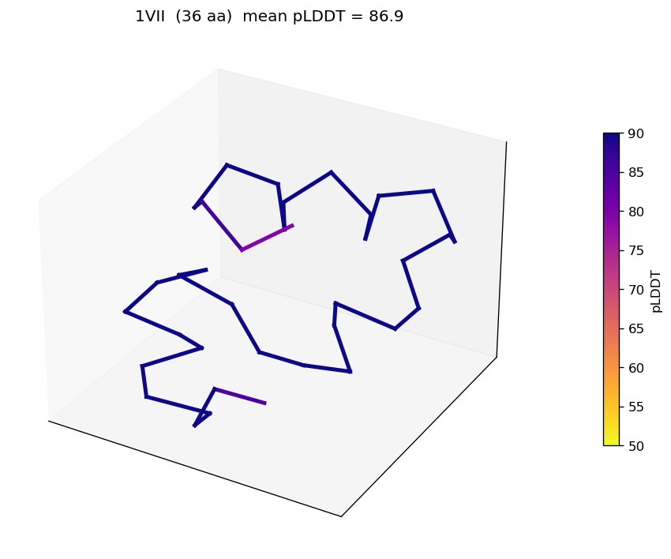
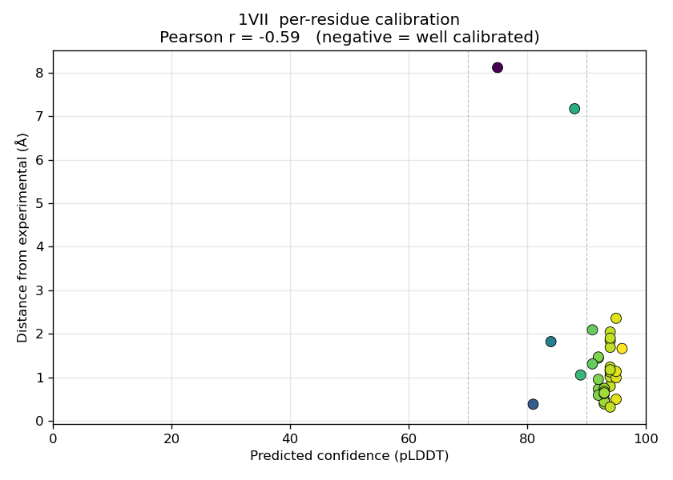

# ESMFold protein structure prediction

This job bundle runs protein structure prediction with [ESMFold](https://www.science.org/doi/10.1126/science.ade2574) (Meta's `facebook/esmfold_v1`, MIT license). The bundle takes a FASTA file as input and produces a `.pdb` file per sequence as output, along with confidence metrics and an optional validation report against experimental reference structures.

The pipeline consists of four steps:

1. Parse the input FASTA, validate sequences, and split records across worker tasks.
2. Run ESMFold inference on each batch of sequences (GPU).
3. Render a backbone trace image of each predicted structure, colored by per-residue confidence.
4. (Optional) Compute TM-score, RMSD, and a per-residue confidence calibration plot against experimental reference PDBs.



## How it works

```
┌─────────────────────────────────────────────────────────────────────┐
│  Deadline Cloud Job: esmfold_predict                                │
│                                                                     │
│  Queue env (Conda): solves CondaPackages →                          │
│    python + pytorch (cuda) + transformers + biotite + matplotlib    │
│                                                                     │
│  ┌───────────────────────────────────────────────────────────────┐  │
│  │ Step 1  SplitFasta              (1 task,  CPU,  ~5 sec)       │  │
│  │   parse FASTA, validate sequences, round-robin into batches   │  │
│  │   →  workspace/batch_1.jsonl ... batch_N.jsonl                │  │
│  └───────────────────────────────────────────────────────────────┘  │
│                              ↓                                      │
│  ┌───────────────────────────────────────────────────────────────┐  │
│  │ Step 2  Fold              (Parallelism tasks, GPU, ~1-30 min) │  │
│  │   load esmfold_v1 (5.2 GB → OutputDir/.hf_cache/)             │  │
│  │   inference per sequence, structural sanity checks            │  │
│  │   →  results/<seq_id>/<seq_id>.pdb + summary.json             │  │
│  └───────────────────────────────────────────────────────────────┘  │
│                              ↓                                      │
│  ┌──────────────────────────────┐ ┌──────────────────────────────┐  │
│  │ Step 3  Render               │ │ Step 4  Validate (optional)  │  │
│  │   (1 task, CPU, ~10 sec)     │ │   (1 task, CPU, ~30 sec)     │  │
│  │   matplotlib backbone trace  │ │   biotite TM-score + Pearson │  │
│  │   colored by per-res pLDDT   │ │   pLDDT/error correlation    │  │
│  │   →  *_plddt_NN.png          │ │   →  validation.csv +        │  │
│  │                              │ │       calibration.png/seq    │  │
│  └──────────────────────────────┘ └──────────────────────────────┘  │
└─────────────────────────────────────────────────────────────────────┘
```

## Prerequisites

The bundle requires a Deadline Cloud farm with an NVIDIA GPU service-managed fleet and a queue with a Conda queue environment attached. The fastest way to set this up is the [`cuda_farm`](../../cloudformation/farm_templates/cuda_farm) CloudFormation template.

```bash
deadline config set defaults.farm_id <FarmId from stack outputs>
deadline config set defaults.queue_id <CUDAQueueId from stack outputs>
```

If you already have a farm, you need:

- An SMF fleet with NVIDIA GPUs (A10G, L4, or A100), at least 16 GB VRAM and 16 GB system RAM.
- A queue with a Conda queue environment that consumes `CondaPackages` and `CondaChannels` job parameters.

### VRAM by sequence length

| Length | VRAM | Recommended GPU |
|---|---|---|
| up to 400 aa | ~12 GB | g5.xlarge (A10G 24 GB) |
| 400-700 aa | ~16-22 GB | g5.2xlarge (A10G 24 GB) |
| 700-1000 aa | ~32-40 GB | p4d.24xlarge (A100 40 GB) |
| over 1024 aa | unsupported | (rejected at the split step) |

### Service quotas

EC2 GPU instances are gated by per-region vCPU quotas. In the [Service Quotas console](https://console.aws.amazon.com/servicequotas/home/services/ec2/quotas), under **EC2**, request increases for **Running On-Demand G and VT instances**. A single `g5.2xlarge` (8 vCPU) needs at least 8 vCPU running concurrently per parallel fold task.

## How to submit this job

Use the [AWS Deadline Cloud client](https://github.com/aws-deadline/deadline-cloud) to submit this job, either as a CLI command or with a GUI.

The default sample folds three short benchmark proteins (Trp-cage 1L2Y/2JOF, villin headpiece 1VII):

```
$ deadline bundle submit ./job_bundles/esmfold_predict/ \
    -p InputFasta=./job_bundles/esmfold_predict/sample_inputs/demo.fasta
```

The first fold on a fresh worker downloads the 5.2 GB `facebook/esmfold_v1` weights into `<OutputDir>/.hf_cache/`. On a g5.2xlarge this takes about 3 minutes. The fold itself runs in less than a minute for the demo sequences, and subsequent fold tasks in the same job reuse the cache.

### Validating against experimental references

To compare predictions against experimentally-determined structures from RCSB, fetch the reference PDBs and pass the directory as `ReferencePdbDir`:

```
$ cd job_bundles/esmfold_predict/sample_inputs/reference_pdbs
$ for id in 1l2y 2jof 1vii; do
    curl -s "https://files.rcsb.org/download/${id}.pdb" -o "${id}.pdb"
  done
$ cd -

$ deadline bundle submit ./job_bundles/esmfold_predict/ \
    -p InputFasta=./job_bundles/esmfold_predict/sample_inputs/demo.fasta \
    -p ReferencePdbDir=./job_bundles/esmfold_predict/sample_inputs/reference_pdbs
```

The `Validate` step writes `<OutputDir>/validation.csv` plus a per-sequence `calibration.png`. See [Validation strategy](#validation-strategy) below.

### Folding your own sequences

```
$ deadline bundle submit ./job_bundles/esmfold_predict/ \
    -p InputFasta=./my_proteins.fasta \
    -p Parallelism=8
```

Sequences are validated up front (length up to 1024 aa, only the 20 standard amino acids plus X for unknown) and round-robin distributed across `Parallelism` GPU tasks. The splitter sorts longest-first so long sequences do not pile up on a single worker.

## Parameters

| Parameter | Default | Description |
|---|---|---|
| `InputFasta` | (required) | FASTA file. One record per protein. Maximum 1024 aa per sequence. |
| `Parallelism` | `2` | Number of GPU tasks to fan out across. Sequences are round-robin distributed by length. |
| `ReferencePdbDir` | (empty) | Optional directory of `<seq_id>.pdb` experimental references. Enables the `Validate` step. |
| `ChunkSize` | `64` | ESMFold axial-attention chunk size. Lower values reduce VRAM at the cost of speed. |
| `OutputDir` | `esmfold_runs` | Output directory. Predictions are written to `<OutputDir>/results/<seq_id>/`. |

## Output

```
<OutputDir>/
├── results/
│   ├── <seq_id_1>/
│   │   ├── <seq_id_1>.pdb                  # structure (pLDDT in B-factor column)
│   │   ├── <seq_id_1>_plddt_<NN>.png       # backbone trace, colored by pLDDT
│   │   ├── calibration.png                 # only when ReferencePdbDir is set
│   │   └── summary.json                    # per-sequence metrics
│   └── ...
├── validation.csv                          # only when ReferencePdbDir is set
└── .hf_cache/                              # 5.2 GB cached model weights
```

`summary.json` per sequence:

```json
{
  "id": "1vii",
  "length": 36,
  "fold_seconds": 5.12,
  "mean_plddt": 86.9,
  "min_plddt": 57.0,
  "max_plddt": 96.0,
  "atom_count": 294,
  "tm_score": 0.6555,
  "rmsd": 2.17,
  "plddt_error_pearson": -0.5888
}
```

TM-score, RMSD, and Pearson r are only populated when `ReferencePdbDir` is set.

`validation.csv` aggregates the per-sequence metrics across all folded sequences:

```
seq_id,tm_score,rmsd,aligned_residues,mean_plddt,plddt_error_pearson
1l2y,0.5589,0.549,20,85.54,-0.2767
1vii,0.6555,2.170,36,86.90,-0.5888
2jof,0.4530,0.967,20,87.25,-0.2876
```

### Loading a predicted structure

The PDB files use the standard format with pLDDT confidence stored in the B-factor column.

```python
from biotite.structure.io.pdb import PDBFile
structure = PDBFile.read("esmfold_runs/results/1vii/1vii.pdb").get_structure(
    model=1, extra_fields=["b_factor"]
)
```

```bash
# PyMOL: color by pLDDT (B-factor) automatically
pymol esmfold_runs/results/1vii/1vii.pdb \
  -d "spectrum b, orange_yellow_cyan_blue, minimum=50, maximum=90; cartoon"
```

## Validation strategy

The bundle validates its output at three layers, in increasing rigor.

**Layer 1: structural sanity** (in `fold.py`). After every prediction, the bundle parses the written PDB to confirm the atom count matches the sequence length and no coordinates are NaN. It also checks that pLDDT values fall in `[0, 100]`. The task fails on violation. This check catches silent inference corruption such as CUDA OOM that swallows half the output, or model rescaling bugs.

**Layer 2: self-consistency** (in `summary.json`). Mean pLDDT is recorded per structure. ESMFold's confidence bands run from low (below 50) through unreliable (50 to 70) and confident (70 to 90) up to high confidence (above 90). Layer 2 does not fail the task, since a confident but wrong prediction still passes it.

**Layer 3: ground truth** (in `validate.py`, the optional `Validate` step). When `ReferencePdbDir` is provided, the bundle computes three metrics against each experimental reference:

- **TM-score** (via biotite's native `tm_score`). Global structural similarity, alignment-aware. Range `[0, 1]`. Above 0.5 indicates the same fold. Above 0.8 is nearly identical.
- **RMSD**. Average atom-to-atom distance after optimal superposition. Sub-1 Å is a strong result on small proteins.
- **pLDDT-error Pearson r**. For each residue, the predicted confidence (pLDDT) is plotted against the actual distance from the experimental structure. A well-calibrated model produces a strongly negative correlation: high pLDDT corresponds to small error. This catches confidently-wrong predictions that layer 2 misses.

The bundle includes a per-sequence calibration plot:



Each dot is one residue. The horizontal axis is predicted confidence, the vertical axis is actual distance from experimental. Pearson r = −0.59 indicates high-confidence residues cluster at low error and the two outliers at 7 to 8 Å sit at lower pLDDT (75 to 88), so the model correctly reduced its confidence on the residues it got wrong.

### TM-score on short proteins

TM-score is normalized for proteins of about 30 residues or more. For short sequences (the demo's 20-aa trp-cage targets), TM values can read low (0.45 to 0.6) even when the prediction is correct. Read the RMSD column for those.

## Notes

**Cold-start weight download.** `facebook/esmfold_v1` weights cache into `<OutputDir>/.hf_cache/` so they persist within a single job, but a new job on a fresh worker downloads them again. For production runs, pre-stage the weights as a job attachment input by passing a pre-downloaded HuggingFace cache directory as a `dataFlow: IN` PATH parameter and pointing `HF_HOME` at it before importing transformers.

**Monomer only.** ESMFold accepts multiple chains via the `:` separator, but quality is much weaker than AlphaFold-Multimer. For multimer prediction, use AlphaFold-Multimer or AF3.

## Choosing a model

The bundle is pinned to `facebook/esmfold_v1`:

- License: MIT, ungated on HuggingFace.
- Maintenance: `facebookresearch/esm` was archived in August 2024. `facebook/esmfold_v1` on HuggingFace is the current reference implementation. The HuggingFace transformers integration removes the OpenFold custom-CUDA-kernel dependency that the original `fair-esm[esmfold]` install path required.
- Single-environment install: a single Conda environment, with the MSA and multi-stage data pipelines removed.

For the highest accuracy on hard targets, use AlphaFold2 instead. ESMFold trails AF2 by roughly 10 to 20% GDT-TS on orphan or de novo sequences because it does not use evolutionary information from MSAs.

## References

- [Lin et al. 2023, *Science*](https://www.science.org/doi/10.1126/science.ade2574): original ESMFold paper.
- [HuggingFace `facebook/esmfold_v1`](https://huggingface.co/facebook/esmfold_v1): model card.
- [HuggingFace transformers ESM docs](https://huggingface.co/docs/transformers/en/model_doc/esm): API reference.
- [biotite `tm_score`](https://www.biotite-python.org/latest/apidoc/biotite.structure.tm_score.html): TM-score implementation used by `validate.py`.
