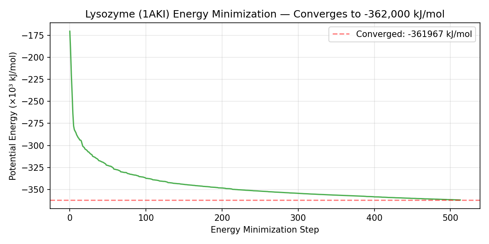

# GROMACS Molecular Dynamics

[Molecular dynamics (MD)](https://en.wikipedia.org/wiki/Molecular_dynamics) simulates the physical movement of atoms in a protein over time, revealing how it folds, binds drugs, or changes shape. It's used to validate virtual screening hits and predict protein stability, and to study binding mechanisms at atomic resolution.

This job bundle uses [GROMACS](https://www.gromacs.org/), an open-source MD engine. It runs the full simulation pipeline from raw protein structure to analyzed trajectory, and supports parallel fan-out across independent replica simulations.

```
    Input PDB          Simulation Trajectory              Analysis
    ┌─────────┐       ┌─────────────────────┐           ┌──────────────┐
    │ Protein │       │  ~~~   ~~~   ~~~    │           │ RMSD: 0.12 nm│
    │ + Water │ ───→  │  Atoms moving over  │  ───→     │ RMSF per atom│
    │ + Ions  │       │  nanoseconds (fs    │           │ Rg: 1.4 nm   │
    └─────────┘       │  timestep)          │           │ H-bonds: 142 │
                      └─────────────────────┘           └──────────────┘
    (solvated box)    (.xtc trajectory file)            (.xvg plot data)
```

## Example Output



*The system starts with high energy (atoms clashing after solvation) and rapidly converges to a stable minimum. This confirms the simulation setup is physically valid before running the expensive dynamics.*

## How It Works

```
Step 1: PrepareSystem  (per replica)
  PDB → pdb2gmx → editconf → solvate → genion (topology + solvated box)

Step 2: EnergyMinimization  (per replica, depends on Step 1)
  grompp + mdrun with steepest descent

Step 3: Equilibration  (per replica, depends on Steps 1+2)
  NVT (100 ps, V-rescale thermostat) → NPT (100 ps, Parrinello-Rahman barostat)

Step 4: ProductionMD  (per replica, depends on Steps 1+3)
  Unrestrained NPT simulation (configurable length)

Step 5: Analysis  (per replica, depends on Steps 1+4)
  RMSD, RMSF, radius of gyration, hydrogen bonds, energy
```

For multi-replica campaigns, all replicas run through the full pipeline independently in parallel via the `ReplicaIndex` parameter space.

## Prerequisites

1. **Deadline Cloud farm** with a Linux SMF fleet (x86_64, min 4 vCPU).

2. **Conda queue environment** with `gromacs` from conda-forge:
   - Set your queue's `CondaChannels` to `conda-forge`
   - Set `CondaPackages` to `gromacs`

3. **Deadline CLI**:
   ```bash
   pip install deadline
   ```

## Sample Data

Sample data for a quick test uses hen egg-white lysozyme (PDB: 1AKI), the standard GROMACS tutorial system:

- **Protein**: Download from the RCSB Protein Data Bank:
  ```bash
  curl -LO https://files.rcsb.org/download/1AKI.pdb
  grep "^ATOM" 1AKI.pdb > protein.pdb  # strip to protein atoms only
  ```
- **MDP files**: Included in this bundle under `sample_inputs/mdp/`.

### Data Attribution

| File | Source | License |
|------|--------|---------|
| protein.pdb | [RCSB PDB 1AKI](https://www.rcsb.org/structure/1AKI), Hen egg-white lysozyme (Diamond, 1974, J Mol Biol) | CC0 1.0 (Public Domain) |
| mdp/*.mdp | Original work: standard GROMACS simulation parameters | Apache-2.0 (this repo) |

## Usage

```bash
deadline bundle submit path/to/gromacs_md \
  -p "InputPdb=sample_data/protein.pdb" \
  -p "MdpMinimization=sample_data/mdp/minimization.mdp" \
  -p "MdpNvt=sample_data/mdp/nvt.mdp" \
  -p "MdpNpt=sample_data/mdp/npt.mdp" \
  -p "MdpProduction=sample_data/mdp/production.mdp" \
  -p "OutputDir=output" \
  -p "ProductionSteps=500000" \
  -p "MaxReplicaIndex=0"
```

### Key Parameters

| Parameter | Description | Default |
|-----------|-------------|---------|
| ForceField | GROMACS force field | amber99sb-ildn |
| WaterModel | Water model | tip3p |
| BoxDistance | Distance from solute to box edge (nm) | 1.0 |
| ProductionSteps | MD steps (500000 = 1 ns at 2 fs) | 500000 |
| MaxReplicaIndex | Last replica index (for parallel replicas) | 0 |

### Multi-Replica Example

Run 10 independent simulations in parallel:
```bash
deadline bundle submit path/to/gromacs_md \
  -p "InputPdb=protein.pdb" \
  -p "MdpMinimization=mdp/minimization.mdp" \
  -p "MdpNvt=mdp/nvt.mdp" \
  -p "MdpNpt=mdp/npt.mdp" \
  -p "MdpProduction=mdp/production.mdp" \
  -p "ProductionSteps=5000000" \
  -p "MaxReplicaIndex=9" \
  -p "JobName=lysozyme-10replicas"
```

## Performance

Tested with lysozyme (1AKI) on c5d.xlarge (4 vCPU, Spot):
- 10,000 steps (20 ps) completed in 90 seconds
- Performance: 19 ns/day
- Full pipeline (prep + EM + NVT + NPT + production + analysis) in ~30 minutes

For longer simulations, consider larger instances (c5.4xlarge, 16 vCPU) or GPU instances (g5.xlarge with CUDA-enabled GROMACS).

## Software Setup

GROMACS is installed via the queue's Conda environment from conda-forge. No host configuration script or custom conda recipe needed. Add `gromacs` to your queue's Conda packages.

## Use Cases

- **Drug binding studies**: simulate protein-ligand complexes to validate virtual screening hits
- **Protein stability**: compare wild-type vs mutant dynamics (fan out across variants)
- **Free energy perturbation**: parallel lambda windows for binding affinity prediction
- **Conformational sampling**: multiple replicas for enhanced sampling statistics
