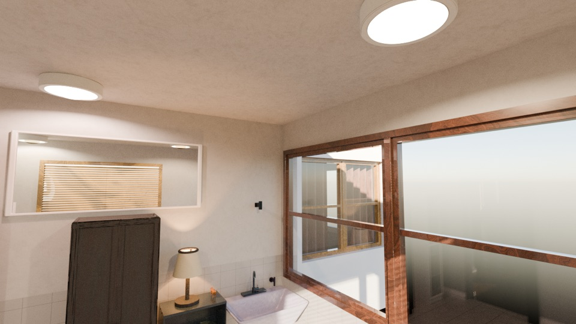
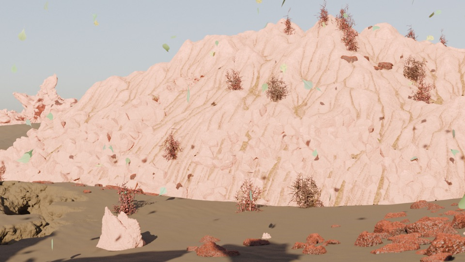
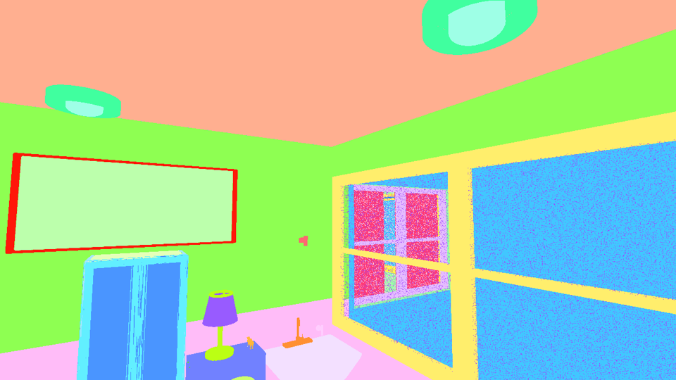
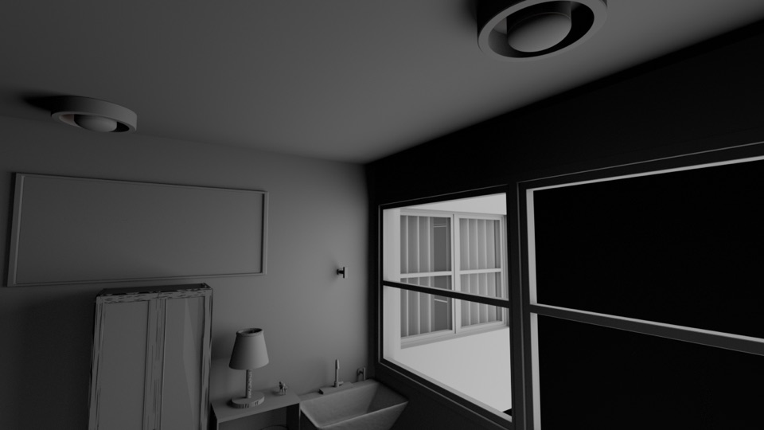

# Infinigen scene generation job bundle

Generates photorealistic 3D scenes using [Infinigen](https://infinigen.org/)
on AWS Deadline Cloud GPU workers. Supports indoor rooms (dining room,
bedroom, kitchen, etc.) and outdoor nature landscapes (desert, forest,
mountain, etc.).

Each seed produces a completely unique scene — different room layout,
furniture, materials, terrain, and vegetation. Seeds fan out as independent
tasks for parallel execution across the GPU fleet.

## Sample outputs

Renders produced by this job bundle (one seed each, full quality):

| Indoor (`SceneType=indoor`, `RoomType=Bathroom`) | Nature (`SceneType=nature`, `desert.gin`) |
| :---: | :---: |
|  |  |

## Prerequisites

1. The `infinigen` conda package built and published to your Deadline Cloud
   farm's S3 conda channel. See the
   [`infinigen-1.19.0` conda recipe README](../../conda_recipes/infinigen-1.19.0/README.md).
2. A [conda queue environment](https://docs.aws.amazon.com/deadline-cloud/latest/userguide/create-queue-environment.html)
   attached to your queue. The
   [`conda_queue_env_improved_caching.yaml`](../../queue_environments/conda_queue_env_improved_caching.yaml)
   sample is a good fit because the dependency closure is large and benefits
   from environment caching between jobs.
3. A GPU-capable Linux service-managed fleet (or equivalent customer-managed
   fleet) associated with the queue. The
   [CUDA farm CloudFormation template](../../cloudformation/farm_templates/cuda_farm/README.md)
   provides a quick way to deploy one.

## Submit jobs

The job's parameter space is driven by the `Frames` parameter (the seed range
fans out into independent tasks). The other parameters select the scene type,
configs, and rendering options.

```bash
# Single indoor dining room (quick test, ~15 min)
deadline bundle submit job_bundles/infinigen_scene_gen/ \
  -p Frames="0-0" \
  -p SceneType="indoor" \
  -p SceneConfig="fast_solve.gin singleroom.gin" \
  -p RoomType="DiningRoom" \
  --max-retries-per-task 0

# 10 unique bedrooms in parallel
deadline bundle submit job_bundles/infinigen_scene_gen/ \
  -p Frames="0-9" \
  -p SceneType="indoor" \
  -p SceneConfig="fast_solve.gin singleroom.gin" \
  -p RoomType="Bedroom" \
  --max-retries-per-task 0

# Desert landscape, fast quality
deadline bundle submit job_bundles/infinigen_scene_gen/ \
  -p Frames="0-0" \
  -p SceneType="nature" \
  -p SceneConfig="desert.gin simple.gin" \
  -p RenderGroundTruth="False" \
  --max-retries-per-task 0

# Desert landscape, full quality (30-60+ min)
# The populate_snake_enabled=False override works around an upstream bug in
# Infinigen v1.19.0; see Known issues below.
deadline bundle submit job_bundles/infinigen_scene_gen/ \
  -p Frames="0-0" \
  -p SceneType="nature" \
  -p SceneConfig="desert.gin" \
  -p SceneOverrides="populate_scene.populate_snake_enabled=False" \
  -p RenderGroundTruth="False" \
  --max-retries-per-task 0
```

You can also run the GUI submitter:

```bash
deadline bundle gui-submit job_bundles/infinigen_scene_gen/
```

## Available scene configs

**Indoor** (`SceneType=indoor`): `fast_solve.gin singleroom.gin`

- Room types: `DiningRoom`, `Bedroom`, `Kitchen`, `LivingRoom`, `Bathroom`,
  or `ANY` (random).

**Nature** (`SceneType=nature`):

- `desert.gin`, `forest.gin`, `mountain.gin`, `coast.gin`, `arctic.gin`
- `canyon.gin`, `cliff.gin`, `river.gin`, `cave.gin`, `coral_reef.gin`
- Add `simple.gin` for fast/low-quality, omit for full quality.

## Outputs

Each scene produces:

- `coarse/scene.blend` — 3D scene file (openable in Blender).
- `frames/Image/camera_0/Image_*.png` — rendered RGB image (1280×720).
- `frames/Image/camera_0/Image_*.exr` — HDR render.
- `frames/MaterialSegmentation/` — per-pixel material ID labels.
- `frames/DiffCol/DiffDir/GlossCol/AO/...` — render passes.
- `frames/camview/` — camera intrinsics/extrinsics.

When `RenderGroundTruth=True`, a second pass with flat shading is rendered
into the same `frames/` directory to provide accurate depth, normals, and
segmentation ground truth.

Examples of the auxiliary passes from the indoor bathroom render above:

| Material segmentation | Ambient occlusion (geometry) |
| :---: | :---: |
|  |  |

## Known issues

### Snake populator crash on Infinigen v1.19.0

Infinigen v1.19.0 has an upstream bug in `reptile.py` where
`reptile_postprocessing()` is called with the wrong arguments, which can
crash nature scene generation. Workaround: set
`SceneOverrides="populate_scene.populate_snake_enabled=False"` on the
submission, as shown in the desert example above.

### Nature scenes without `simple.gin` are slow

Full-quality nature scenes (without `simple.gin`) take 30-60+ minutes per
seed because the full asset library is generated. Use `simple.gin` while
iterating, then drop it for final renders.

### Empty `.blend` viewport

The intermediate `.blend` files show placeholder bounding boxes when opened
in the Blender viewport — this is by design. Full geometry is generated
during the Cycles render pass and is not stored back into the `.blend`.
