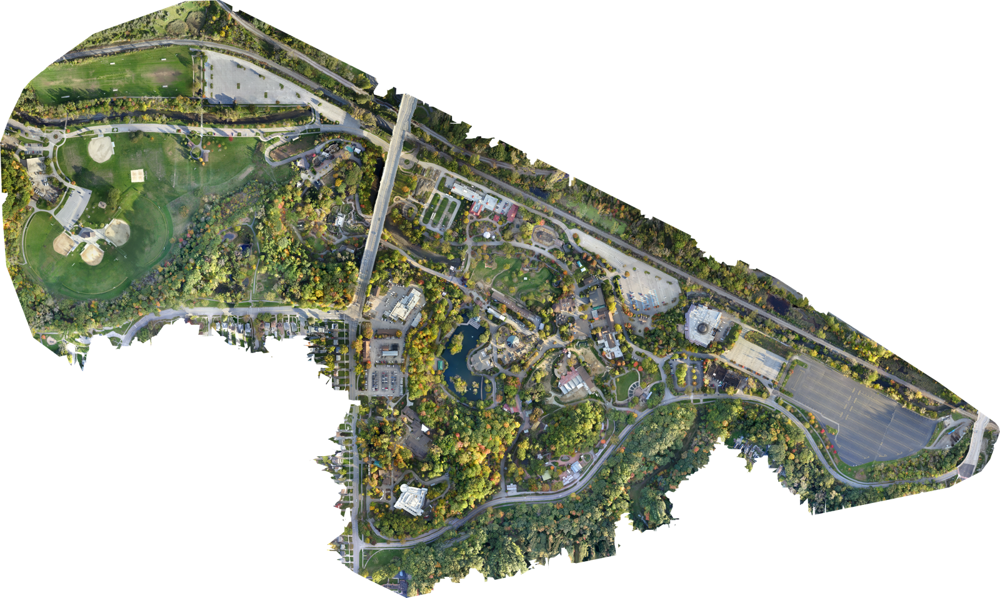

# OpenDroneMap simple job

This job bundle runs a CPU-only
[OpenDroneMap (ODM) 3.6.1](https://github.com/OpenDroneMap/ODM/tree/v3.6.1)
survey reconstruction on AWS Deadline Cloud. A user selects a directory of
geotagged JPEGs, and one task stages the attached images, runs ODM in Docker,
and returns standard geospatial and 3D deliverables through job attachments.

Use this sample to evaluate photogrammetry on a Linux service-managed fleet
without packaging ODM or managing a separate application cluster. The template
processes one survey per job on one worker.

## Prerequisites

- A survey of JPEG images containing valid GPS latitude, longitude, and
  altitude coordinates in their EXIF metadata. ODM uses these coordinates to
  georeference the reconstruction and outputs.
- A Deadline Cloud farm and queue with a Linux service-managed fleet.
- The [Docker Engine host configuration](../../host_configuration_scripts/docker_engine/)
  applied to newly launched workers. Configure the fleet with the custom
  attribute `attr.DockerEngine=available`; the job requires that capability
  to prevent scheduling on Linux workers without Docker.
- Fleet capabilities of at least 8 vCPUs, 32 GiB RAM, and 200 GiB through the
  custom amount `amount.WorkerScratchGiB`. The step requests these minimums
  from the scheduler. Larger surveys can require more memory.
- At least 20 GiB free worker disk for the image layers, attached inputs,
  processing scratch data, and packaged outputs. The task checks this before
  processing.
- Outbound HTTPS access to Docker Hub while the job environment pulls the
  pinned image. The processing container itself has no network access.
- The [Deadline Cloud CLI](https://github.com/aws-deadline/deadline-cloud)
  configured with a default farm and queue, or explicit farm and queue IDs.

The pinned ODM image is a multi-architecture manifest for Linux x86_64 and
ARM64. A worker still needs enough memory and disk; architecture support alone
does not establish that an instance size meets the baseline.

### Create a compatible fleet

This repository does not create Deadline infrastructure. If starting without a
fleet, use the
[Docker Engine setup checklist](../../host_configuration_scripts/docker_engine/):

1. Create or select a farm and a queue with job attachments in the Deadline
   Cloud console.
2. Create a Linux `x86_64` service-managed fleet with a zero minimum, a bounded
   maximum, and worker capacity meeting the 8-vCPU, 32-GiB RAM, and 200-GiB
   `amount.WorkerScratchGiB` minimums.
3. Add `attr.DockerEngine=available`, then paste
   [`linux.sh`](../../host_configuration_scripts/docker_engine/linux.sh) into
   the fleet's **Host configuration** field.
4. Associate the fleet with the queue, launch one worker, and confirm its host
   configuration log ends with `Docker Engine setup complete`.
5. Return the fleet minimum to zero before submitting the job.

### Configure the Deadline CLI

Install or update the client, then set the profile, region, farm, and queue
created above:

```console
pip install --upgrade deadline
deadline config set defaults.aws_profile_name my-profile
deadline config set defaults.farm_region us-west-2
deadline config set defaults.farm_id farm-0123456789abcdef0123456789abcdef
deadline config set defaults.queue_id queue-0123456789abcdef0123456789abcdef
```

You can instead select a farm and queue for each submission. The job's
`attr.DockerEngine=available` host requirement prevents it from using a
generic Linux fleet that does not advertise the Docker configuration.

### Try the public sample survey

The preview below was generated from the CC0-licensed
[OpenDroneMap data-zoo survey](https://github.com/OpenDroneMap/odm_data_zoo/tree/60a74095e297d76062ba14312fa581a74021916a).
Download the same pinned revision and verify it before submission:

```console
curl --fail --location \
    --output odm-data-zoo.tar.gz \
    https://github.com/OpenDroneMap/odm_data_zoo/archive/60a74095e297d76062ba14312fa581a74021916a.tar.gz
echo \
    "a7a86646e8bd7a170a736d8f0973424e552a7454cbc04c1ffec58b104a99a220  odm-data-zoo.tar.gz" \
    | shasum -a 256 --check
tar -xzf odm-data-zoo.tar.gz
```

The archive expands to
`odm_data_zoo-60a74095e297d76062ba14312fa581a74021916a/`; select its
`images/` directory for `InputImages`. It contains 524 JPEGs totaling about
3.44 GiB, so it is a substantial, multi-hour test rather than a quick smoke
test. Use a fleet whose memory range starts at 64 GiB for this survey, monitor
cost while it runs, and remove the downloaded archive and job attachments when
finished. Runtime code treats this directory exactly like a private survey and
does not special-case the sample.

## Submit

From the repository root, review the parameters in the GUI:

```console
deadline bundle gui-submit job_bundles/opendronemap_simple_job
```

Or submit the defaults from the command line:

```console
deadline bundle submit job_bundles/opendronemap_simple_job \
    -p InputImages=/path/to/survey/images \
    -p OutputDir="$(pwd)/odm-output"
```

`InputImages` is uploaded as a `dataFlow: IN` job attachment. Configure the
queue and client for the attachment mode appropriate to your environment.
The bundle creates `open_drone_map/` inside `OutputDir`. Use a new or dedicated
output directory because a retry replaces that sample-owned subdirectory.

## Parameters

| Parameter | Default | Description |
|---|---:|---|
| `InputImages` | none | Directory containing one geotagged RGB JPEG survey. |
| `OutputDir` | `./output` | Job-attachment output directory. |
| `OrthophotoResolution` | `10` | Orthophoto resolution in centimeters per pixel. |
| `FeatureQuality` | `low` | ODM feature extraction quality: `ultra`, `high`, `medium`, `low`, or `lowest`. |
| `PointCloudQuality` | `lowest` | ODM dense point cloud quality using the same quality levels. |
| `GenerateDsm` | `True` | Generate ODM's DSM elevation raster. |
| `GenerateDtm` | `False` | Classify ground points and generate a digital terrain model. |
| `MaxConcurrency` | `2` | Positive integer limiting concurrent ODM processes. ODM estimates roughly 1 GiB per process for 2-megapixel images. |

The task recursively finds `.jpg` and `.jpeg` files case-insensitively and
flattens them into ODM's `images/` directory, so image basenames must be unique
without regard to case. Empty files, symlinks, duplicate content, and
directories without JPEGs are rejected. ODM performs the authoritative image,
camera, and geolocation validation.

## Data flow and progress

The job environment pulls and verifies the pinned ODM image before `onRun`.
The task then uses the OpenJD session working directory for staged inputs and
all ODM intermediates:

1. Check Docker and verify at least 20 GiB free disk.
2. Inventory and checksum the attached JPEGs, then stage them into a generic
   ODM project named `survey`.
3. Run the container without network access and stream every ODM log line to
   Deadline Cloud.
4. Translate ODM's stage messages into `openjd_status` and `openjd_progress`
   updates for the Monitor.
5. Copy only deliverables to `OutputDir/open_drone_map`, verify every required
   artifact, and write a checksummed JSON manifest.

The task uses OpenJD's notify-then-terminate cancellation mode. On cancellation,
the script asks Docker to stop ODM and allows up to 20 seconds for shutdown. It
then removes the ODM task container, packages any partial log/results, and
returns the container status. Normal nonzero ODM exits are also returned
unchanged.

Each task uses a fresh, network-disabled `--rm` container labeled for its
worker session. The job environment removes any labeled container left behind
by abnormal termination when the session exits.

## Outputs

Successful defaults produce:

```text
open_drone_map/
|-- manifest.json
|-- odm.log
|-- odm_dem/
|   `-- dsm.tif
|-- odm_georeferencing/
|   `-- odm_georeferenced_model.laz
|-- odm_orthophoto/
|   `-- odm_orthophoto.tif
|-- odm_report/
|   `-- report.pdf
`-- odm_texturing/
    |-- odm_textured_model_geo.obj
    |-- odm_textured_model_geo.mtl
    `-- ... texture images and supporting model files
```

The image below is a browser-sized PNG preview of
`odm_orthophoto/odm_orthophoto.tif`. The GeoTIFF returned by the job remains
the authoritative geospatial output.



Enabling `GenerateDtm` also requires and returns `odm_dem/dtm.tif`. The
manifest records the ODM version and image digest; the relative path, staged
name, size, and checksum of every input image; all processing parameters,
timestamps, duration, exit status, and host architecture; and the size and
SHA-256 of every returned artifact.

### ODM sample manifest

`manifest.json` uses a versioned format defined specifically for the
OpenDroneMap samples in this repository. It is not an OpenJD specification,
Deadline Cloud job-attachment manifest, or general
`deadline-cloud-samples` format.

OpenJD controls when the task runs; the manifest verifies what that task
consumed and produced. It provides input provenance, pinned application
identity, parameter and outcome recording, and a checksummed final artifact
inventory so successful, failed, and canceled runs can be audited.

Every document identifies that contract with:

```json
{
  "format": "opendronemap-sample-manifest",
  "schema_version": 1,
  "kind": "simple_run"
}
```

The remaining top-level fields are `application`, `input`, `parameters`,
`runtime`, and `artifacts`. Each artifact has a path relative to
`open_drone_map/`, an ODM-specific role, its byte size, and SHA-256 digest.
The input inventory uses paths relative to the selected directory and does not
record the absolute workstation path.
The runtime records `success`, `failed`, or `canceled` plus the task and
container exit codes. Failed and canceled runs write the same manifest when
the output directory is available, so partial logs and artifacts can be
audited.

Use a geospatial application such as QGIS for the GeoTIFF, CloudCompare for
LAZ, and MeshLab for OBJ. The OBJ, material file, and textures must remain
together in `odm_texturing/`.

## Security, cost, and cleanup

Users are responsible for ensuring they have the right to process their
selected survey images. ODM is distributed under AGPL-3.0-only; this sample
runs its unmodified official container.

The Docker host configuration adds `job-user` to the `docker` group. That group
has root-equivalent host access, so route only trusted jobs to this fleet.
The task container receives only the session dataset volume and has networking
disabled after the image pull.

Deadline Cloud charges for worker time and job-attachment storage/transfer.
Approximate worker cost is the service-managed fleet rate for the selected
instance multiplied by the worker's billed runtime; consult
[AWS Deadline Cloud pricing](https://aws.amazon.com/deadline-cloud/pricing/)
and the Monitor usage explorer for the actual job estimate.

After validation, restore the fleet minimum worker count to zero and confirm the
worker terminates. Download job outputs before deleting the job if they are
needed later.

## Validate and troubleshoot

Static validation from the bundle directory:

```console
python3 -m compileall scripts tests
python3 -m unittest discover -s tests -v
openjd check template.yaml
openjd summary template.yaml -p InputImages=/path/to/survey/images
```

Run locally only on a Linux host with Docker and at least 20 GiB free:

```console
mkdir -p output
openjd run template.yaml \
    -p InputImages=/path/to/survey/images \
    -p OutputDir="$(pwd)/output"
```

Common failures:

- **Docker permission denied:** confirm the worker was launched after applying
  the host configuration and its log verified Docker as `job-user`.
- **Input rejected:** use regular, nonempty JPEG files with unique basenames.
  Remove symlinks and duplicate images before submission.
- **Exit 134 or 137, or `std::bad_alloc`:** ODM exhausted memory. Increase
  fleet memory or lower quality and concurrency.
- **Missing expected artifact:** ODM returned zero but did not produce the
  declared result set. The task fails and lists the missing relative path; use
  `odm.log` and partial outputs for diagnosis.
- **Image pull failure:** verify outbound DNS and HTTPS access to Docker Hub.

The tests under `tests/` use an in-process runner double to cover external
failures, input inventory, cancellation, manifest generation, and missing
artifact rejection without starting Docker.
