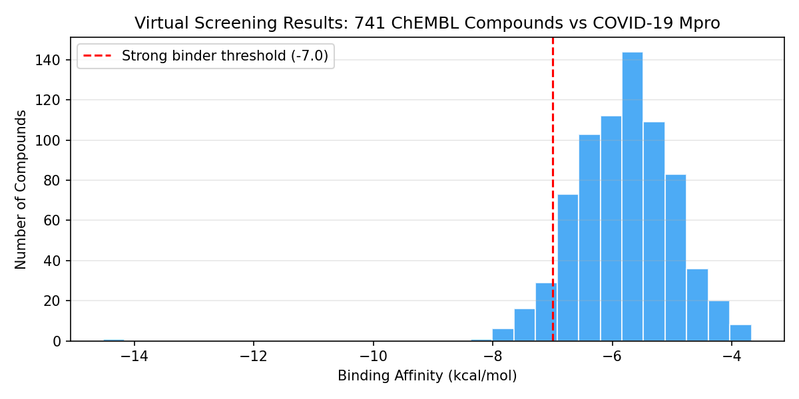

# Virtual Screening with AutoDock VINA

[Virtual screening](https://en.wikipedia.org/wiki/Virtual_screening) is a computational drug discovery technique that searches large libraries of small molecules to find those most likely to bind a protein target (e.g., a viral enzyme or cancer receptor). By predicting binding affinity computationally, researchers narrow millions of candidates down to a few hundred for lab testing — drastically reducing cost and time in early-stage drug discovery.

This job bundle uses [AutoDock VINA](https://github.com/ccsb-scripps/AutoDock-Vina), an open-source docking engine. It splits a compound library into chunks and docks them in parallel across a fleet of workers.

```
    Protein Target              Compound Library (millions)         Top Hits
    ┌─────────┐                ┌─┬─┬─┬─┬─┬─┬─┬─┬─┬─┐            ┌─────┐
    │  ╭───╮  │   AutoDock     │ │ │ │ │ │ │ │ │ │ │   Ranked    │ ★ 1 │ -9.2 kcal/mol
    │  │   │  │ ──── VINA ───→ │ │ │ │ │ │ │ │ │ │ │ ─── by ──→ │ ★ 2 │ -8.7 kcal/mol
    │  ╰───╯  │   (parallel)   │ │ │ │ │ │ │ │ │ │ │  affinity   │ ★ 3 │ -8.4 kcal/mol
    └─────────┘                └─┴─┴─┴─┴─┴─┴─┴─┴─┴─┘            └─────┘
    (binding site)              (SDF/SMILES format)                (CSV output)
```

## Example Output



*Most compounds bind weakly (-4 to -6 kcal/mol), but 44 compounds cross the -7.0 threshold into "worth testing in the lab" territory — those are the drug candidates you'd synthesize and validate experimentally.*

## How It Works

```
Step 1: PrepareReceptor  (1 task)
  Convert protein PDB → PDBQT format via Open Babel

Step 2: SplitLibrary  (1 task, depends on Step 1)
  Split SDF compound library into N chunks

Step 3: DockCompounds  (N tasks, parallel, depends on Steps 1+2)
  ┌────────┐ ┌────────┐ ┌────────┐     ┌────────┐
  │Chunk 0 │ │Chunk 1 │ │Chunk 2 │ ... │Chunk N │
  └───┬────┘ └───┬────┘ └───┬────┘     └───┬────┘
      │          │          │               │
      ▼          ▼          ▼               ▼
  obabel → VINA dock → extract scores (per chunk, idempotent)

Step 4: ScoreAndRank  (1 task, depends on Step 3)
  Aggregate all chunk results → ranked CSV of top hits by binding affinity
```

Each docking task is idempotent (safe for Spot preemption — skips if results already exist).

## Prerequisites

1. **Deadline Cloud farm** with a Linux SMF fleet (x86_64, Spot recommended).

2. **Software dependencies**:
   - **OpenBabel**: Installed automatically via the queue's Conda environment from conda-forge (default `CondaPackages` includes `openbabel`).
   - **AutoDock VINA**: Not available on conda-forge. Two options:
     - **(Recommended)** Build the conda recipe at [`conda_recipes/autodock-vina-1.2.5/`](../../conda_recipes/autodock-vina-1.2.5/) into your S3 conda channel, then add `autodock-vina` to `CondaPackages` and your S3 channel to `CondaChannels`.
     - **(Quick start)** Use a [fleet host configuration script](../../host_configuration_scripts/) to install the VINA binary at worker boot:
       ```bash
       curl -sL "https://github.com/ccsb-scripps/AutoDock-Vina/releases/download/v1.2.5/vina_1.2.5_linux_x86_64" -o /usr/local/bin/vina
       chmod 755 /usr/local/bin/vina
       ```

3. **Deadline CLI**:
   ```bash
   pip install deadline
   ```

## Sample Data

No pre-downloaded data required. The template can automatically download and filter compounds from [ChEMBL](https://www.ebi.ac.uk/chembl/).

**Receptor** — download any protein from the RCSB Protein Data Bank. Example with COVID-19 Main Protease:
```bash
curl -LO https://files.rcsb.org/download/6LU7.pdb
grep "^ATOM" 6LU7.pdb > receptor.pdb  # strip to protein atoms only
```

**Compound library** — set `CompoundLibrary=chembl` (default) and the template will:
1. Download ChEMBL chemical representations from EBI FTP
2. Filter to drug-like molecules (configurable SMILES length, no salts/mixtures)
3. Convert to SDF format for docking

Or provide your own SDF/SDF.GZ file via the `CompoundLibrary` parameter.

### Data Attribution

| Source | License | Used for |
|--------|---------|----------|
| [RCSB Protein Data Bank](https://www.rcsb.org/) | CC0 1.0 (Public Domain) | Receptor PDB structures |
| [ChEMBL](https://www.ebi.ac.uk/chembl/) (Zdrazil et al., 2024, Nucleic Acids Research) | CC BY-SA 3.0 | Compound library (auto-downloaded) |

## Usage

```bash
# Using ChEMBL (auto-download 100k drug-like compounds):
deadline bundle submit path/to/virtual_screening_vina \
  -p "ReceptorPdb=receptor.pdb" \
  -p "CompoundLibrary=chembl" \
  -p "ChEMBLVersion=37" \
  -p "MaxCompounds=100000" \
  -p "CompoundsPerChunk=100" \
  -p "MaxChunkIndex=999" \
  -p "CenterX=-10.7" \
  -p "CenterY=12.4" \
  -p "CenterZ=68.8" \
  -p "Exhaustiveness=8"

# Using your own compound library:
deadline bundle submit path/to/virtual_screening_vina \
  -p "ReceptorPdb=receptor.pdb" \
  -p "CompoundLibrary=my_compounds.sdf.gz" \
  -p "CompoundsPerChunk=100" \
  -p "MaxChunkIndex=499" \
  -p "CenterX=-10.7" \
  -p "CenterY=12.4" \
  -p "CenterZ=68.8"
```

### Key Parameters

| Parameter | Description | Default |
|-----------|-------------|---------|
| CompoundLibrary | SDF file path, or `chembl` to auto-download | chembl |
| ChEMBLVersion | ChEMBL release version (when using auto-download) | 37 |
| MaxCompounds | Max compounds to extract from ChEMBL | 100000 |
| CompoundsPerChunk | Molecules per parallel task | 1000 |
| MaxChunkIndex | Last chunk index (num_chunks - 1) | 999 |
| CenterX/Y/Z | Docking box center (Angstroms) | 0.0 |
| SizeX/Y/Z | Docking box dimensions (Angstroms) | 20.0 |
| Exhaustiveness | Search thoroughness (1-64) | 8 |
| TopN | Number of top hits to report | 500 |

## Performance

Tested with 100,000 ChEMBL compounds against COVID-19 Main Protease:
- 1,000 parallel tasks across 10 Spot workers
- ~5-8 hours wall clock at exhaustiveness=4
- Best hit: -14.53 kcal/mol
- 44 compounds with affinity < -7.0 kcal/mol (strong binders)

## Software Setup

| Tool | Source | Install method |
|------|--------|----------------|
| OpenBabel | conda-forge | Queue Conda environment (automatic) |
| AutoDock VINA | [GitHub releases](https://github.com/ccsb-scripps/AutoDock-Vina/releases) | Conda recipe (build into S3 channel) or fleet host config |
| Python | conda-forge | Queue Conda environment (automatic) |

See [Prerequisites](#prerequisites) for setup details.
